# aider.el

**aider.el** provides an Emacs interface for Aider, an AI pair programming tool that can directly edit your code with git integration.

## Table of Contents

- [Overview](#overview)
- [Architecture](#architecture)
- [Features](#features)
- [Setup](#setup)
- [Usage Examples](#usage-examples)
- [Workflows](#workflows)
- [Resources](#resources)

## Overview

aider.el brings Aider's powerful AI pair programming capabilities into Emacs, enabling AI-assisted code editing with automatic git commits.

### Key Capabilities

- AI-powered code editing with git integration
- Multi-file context awareness
- Automatic commit generation
- Support for multiple LLM providers (OpenAI, Anthropic, local models)
- Interactive chat interface within Emacs
- Code refactoring and improvement

## Architecture

### Component Architecture

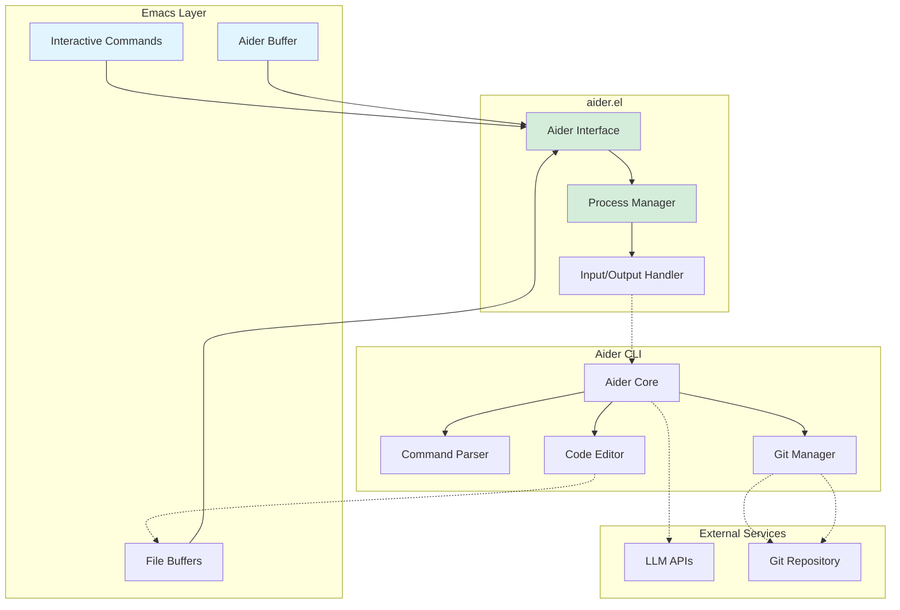

### Process Communication Flow

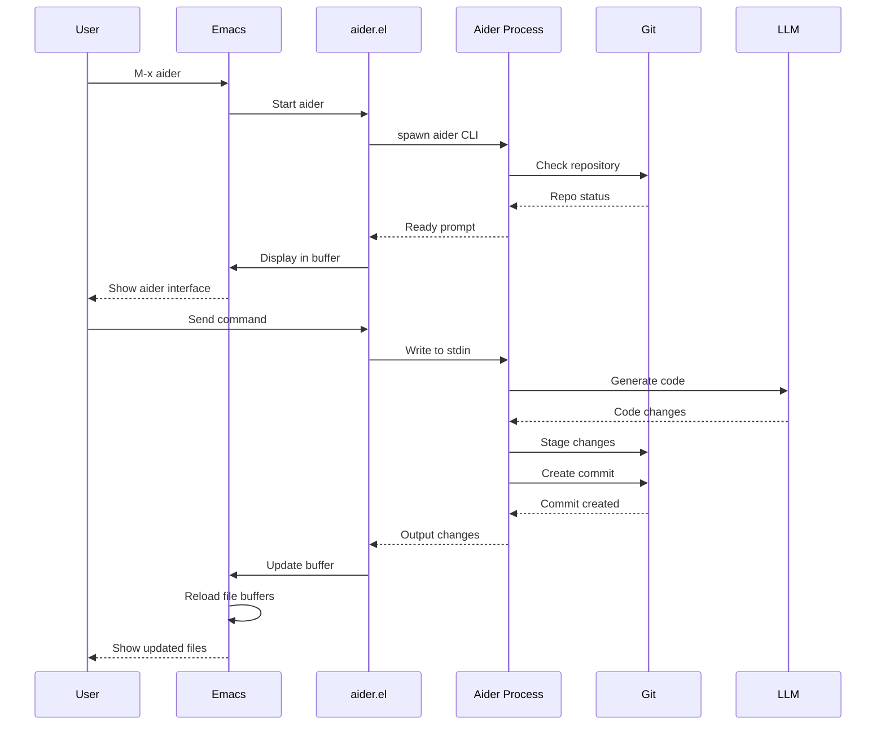

### Git Integration Flow

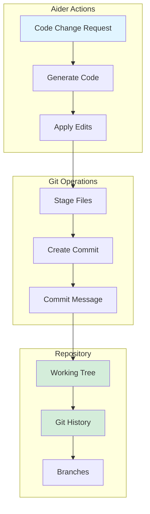

## Features

### Core Capabilities

| Feature | Description | Command |
|---------|-------------|---------|
| Interactive Chat | Chat with AI about code | In aider buffer |
| File Management | Add/remove files from context | `/add`, `/drop` |
| Code Editing | AI makes direct code changes | Natural language requests |
| Git Integration | Automatic commits | Enabled by default |
| Multi-file Support | Edit multiple files | Add multiple files |
| Undo Support | Revert changes | `/undo` |

### Aider Commands

```mermaid
graph TB
    Commands[Aider Commands]

    Commands --> Add[/add file.el]
    Commands --> Drop[/drop file.el]
    Commands --> Undo[/undo]
    Commands --> Clear[/clear]
    Commands --> Help[/help]
    Commands --> Commit[/commit]

    Add --> Context[Add to context]
    Drop --> Remove[Remove from context]
    Undo --> Revert[Revert last change]
    Clear --> Reset[Clear history]
    Help --> Info[Show help]
    Commit --> Save[Force commit]

    style Commands fill:#e1f5ff
    style Add fill:#d4edda
    style Drop fill:#d4edda
    style Undo fill:#d4edda
```

### LLM Provider Support

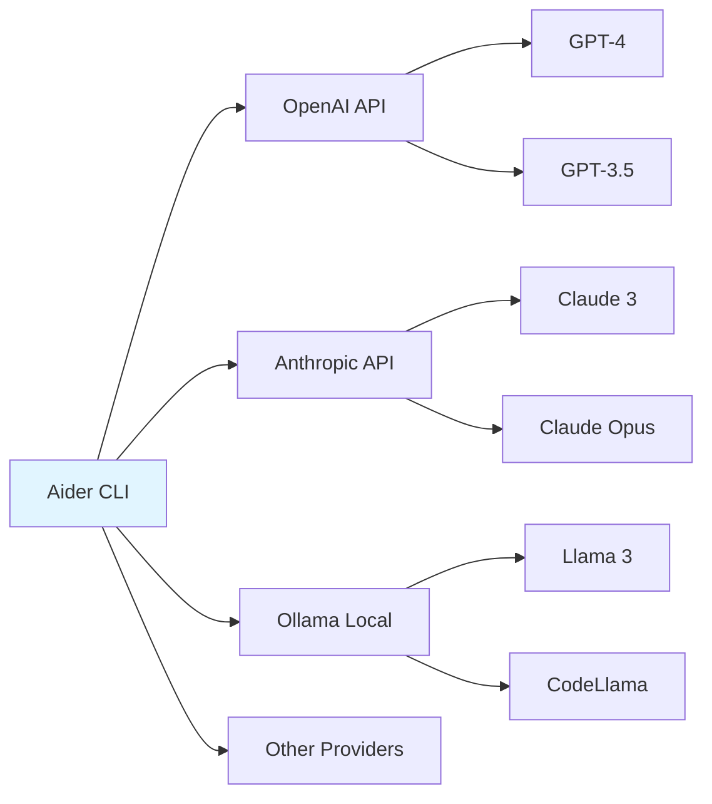

## Setup

### Prerequisites

1. Install Aider CLI:

```bash
# Using pip
pip install aider-chat

# Or using pipx (recommended)
pipx install aider-chat
```

2. Configure API keys (choose one or more):

```bash
# OpenAI
export OPENAI_API_KEY=your-key-here

# Anthropic
export ANTHROPIC_API_KEY=your-key-here

# Or use local models with Ollama
ollama serve
```

### Emacs Configuration

```elisp
;; Install aider.el
;; Note: May need manual installation as it's not in MELPA yet
(use-package aider
  :load-path "path/to/aider.el"
  :config
  ;; Set aider executable path if needed
  (setq aider-executable "aider")

  ;; Optional: Set default arguments
  (setq aider-args '("--no-auto-commits"))

  ;; Key binding
  :bind ("C-c a" . aider))
```

### Advanced Configuration

```elisp
;; Use specific model
(setq aider-args '("--model" "gpt-4"))

;; Use Claude
(setq aider-args '("--model" "claude-3-opus-20240229"))

;; Use local Ollama
(setq aider-args '("--model" "ollama/codellama"))

;; Disable auto-commits
(setq aider-args '("--no-auto-commits"))

;; Custom git settings
(setq aider-args '("--no-auto-commits" "--no-dirty-commits"))
```

## Usage Examples

### Example 1: Add Feature

```elisp
;; Start aider
M-x aider

;; In aider buffer:
/add my-package.el

;; Request feature:
"Add error handling to the fetch-data function"

;; Aider generates code and commits
```

### Example 2: Refactor Code

```elisp
;; Add file to context
/add old-code.el

;; Request refactoring
"Refactor this code to use lexical binding and modern Elisp conventions"

;; Review changes and continue conversation
```

### Example 3: Multi-file Change

```elisp
;; Add multiple files
/add main.el
/add utils.el
/add tests.el

;; Request coordinated changes
"Move the helper functions from main.el to utils.el and update the tests"

;; Aider edits all files and creates commit
```

## Workflows

### Feature Development Workflow

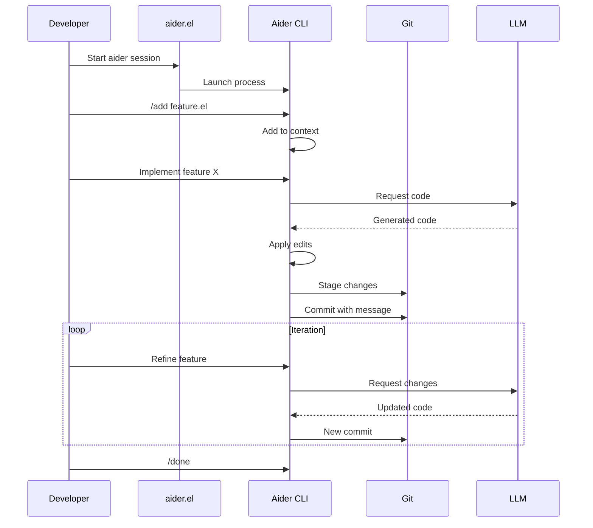

### Bug Fix Workflow

```mermaid
graph TB
    Start[Identify Bug]

    Start --> AddFiles[/add relevant files]
    AddFiles --> Describe[Describe bug]
    Describe --> Generate[Aider generates fix]

    Generate --> Review{Review Fix}
    Review -->|Good| Commit[Auto-commit]
    Review -->|Needs work| Refine[Request refinement]

    Refine --> Generate
    Commit --> Test[Run tests]

    Test -->|Pass| Done[Complete]
    Test -->|Fail| Describe

    style Start fill:#e1f5ff
    style Done fill:#d4edda
```

### Code Review Workflow

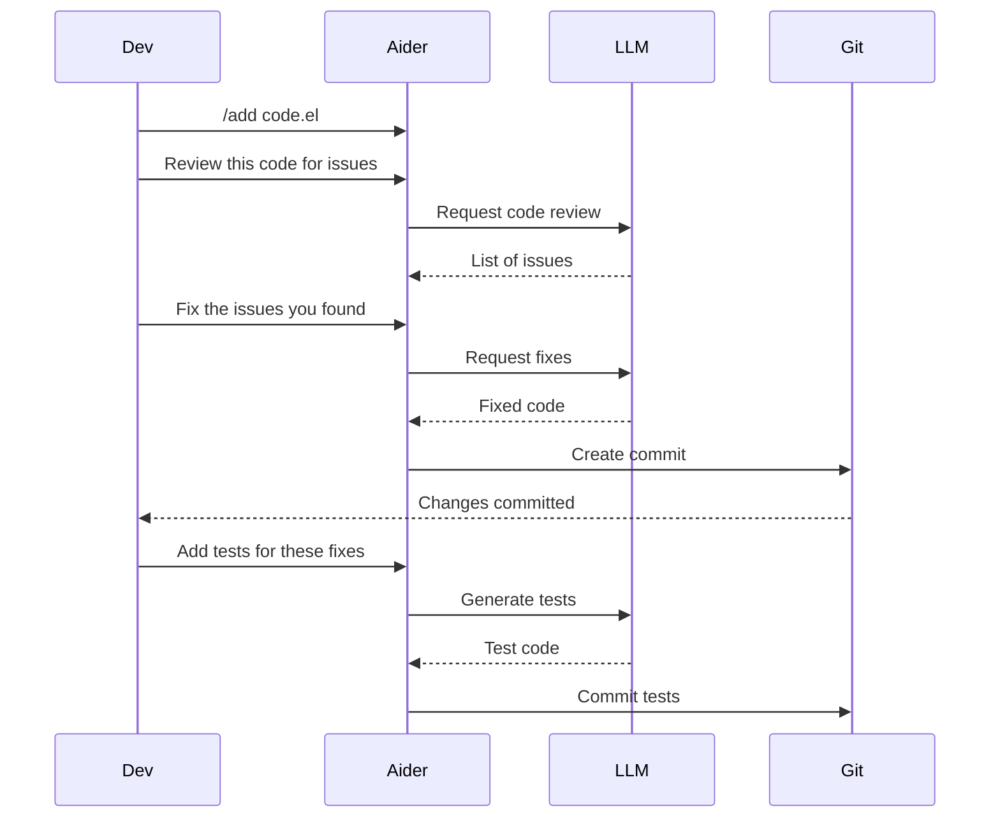

## Data Flow

### Context Management

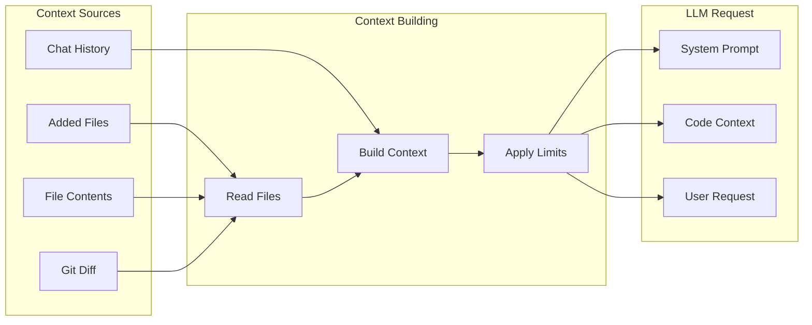

### Code Application

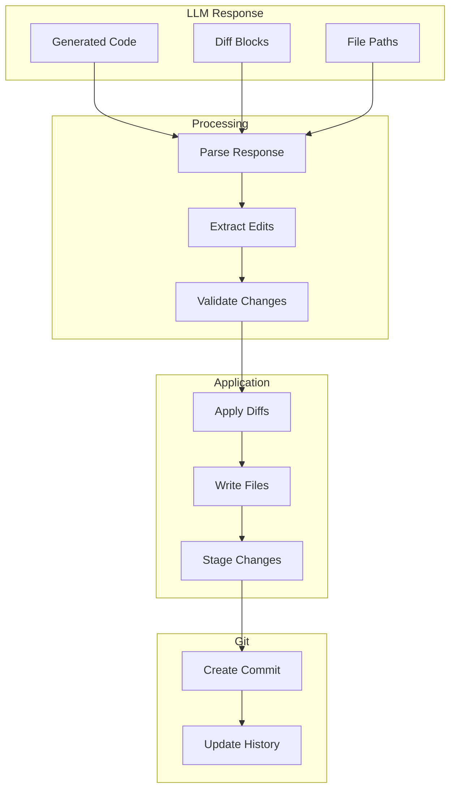

## Advanced Features

### Repository Mapping

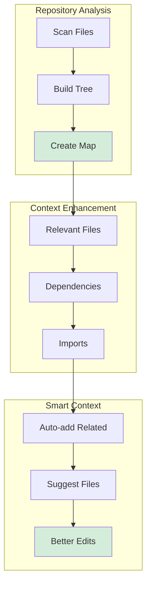

### Commit Management

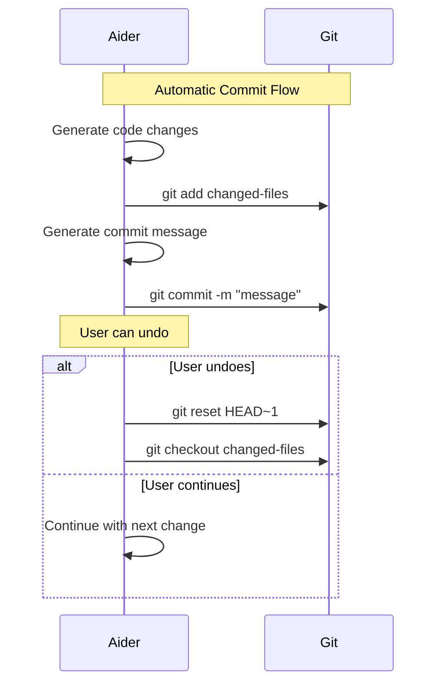

## Integration with Emacs

### File Buffer Synchronization

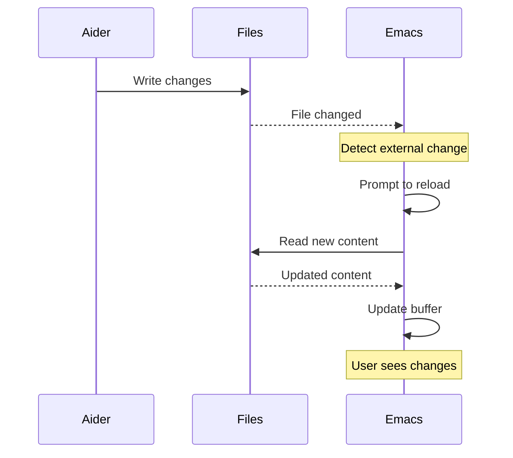

## Advantages

- **Git Integration**: Automatic commit creation
- **Multi-file Editing**: Coordinated changes across files
- **Smart Context**: Repository-aware suggestions
- **Undo Support**: Easy to revert changes
- **Multiple Providers**: Support for various LLMs

## Limitations

- **External Process**: Requires aider CLI installation
- **Git Required**: Must be in a git repository
- **Learning Curve**: More complex than simple chat tools
- **Resource Usage**: May consume significant tokens for large contexts

## Best Practices

1. **Start Small**: Add only relevant files to context
2. **Incremental Changes**: Make one change at a time
3. **Review Commits**: Check generated commits before pushing
4. **Use Undo**: Don't hesitate to undo and retry
5. **Clear Context**: Use `/clear` to reset when changing tasks

## Resources

### Documentation

- [aider.el GitHub Repository](https://github.com/tninja/aider.el)
- [Aider Documentation](https://aider.chat/docs/)
- [Aider GitHub](https://github.com/paul-gauthier/aider)
- [Demo Project](../../tree/master/demo-aider-el)

### Aider Resources

- [Aider Installation Guide](https://aider.chat/docs/install.html)
- [Aider Usage Examples](https://aider.chat/docs/usage.html)
- [Supported Models](https://aider.chat/docs/llms.html)

### Related Documentation

- [Elisp Development Guide](../../blob/master/docs/elisp-development.md)
- [Git Best Practices](https://git-scm.com/book/en/v2)

---

**Navigation**: [Home](Home) | [Architecture](Architecture) | [gptel](Gptel) | [elisp-dev-mcp](Elisp-Dev-MCP)
