# Architecture Overview

This page provides architectural diagrams and documentation for the Emacs AI Study Group project.

## Table of Contents

- [System Architecture](#system-architecture)
- [Component Comparison](#component-comparison)
- [Integration Patterns](#integration-patterns)
- [Data Flow](#data-flow)
- [Common Workflows](#common-workflows)

## System Architecture

### High-Level Component Diagram

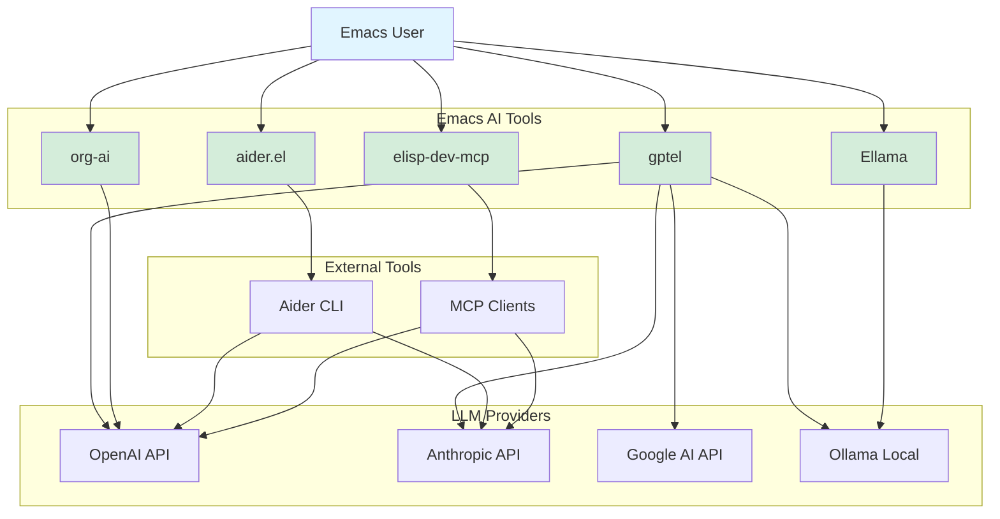

### Layered Architecture

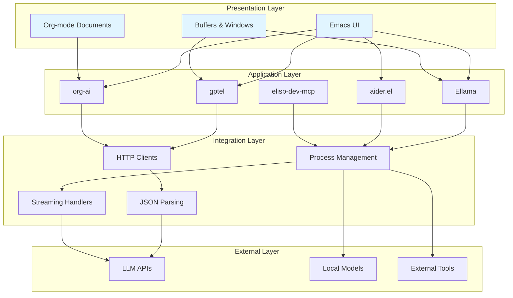

## Component Comparison

### Feature Matrix

| Feature | gptel | org-ai | Ellama | aider.el | elisp-dev-mcp |
|---------|-------|--------|--------|----------|---------------|
| Multi-Provider | ✅ | ❌ (OpenAI) | ❌ (Ollama) | ✅ | ✅ |
| Local Models | ✅ | ❌ | ✅ | ✅ | ❌ |
| Org Integration | ⚠️ (Basic) | ✅ | ❌ | ❌ | ❌ |
| Code Generation | ✅ | ✅ | ✅ | ✅ | ✅ |
| Git Integration | ❌ | ❌ | ❌ | ✅ | ❌ |
| Streaming | ✅ | ✅ | ✅ | ✅ | N/A |
| Testing Support | ✅ | ❌ | ❌ | ❌ | ❌ |
| MCP Protocol | ❌ | ❌ | ❌ | ❌ | ✅ |

### Decision Tree

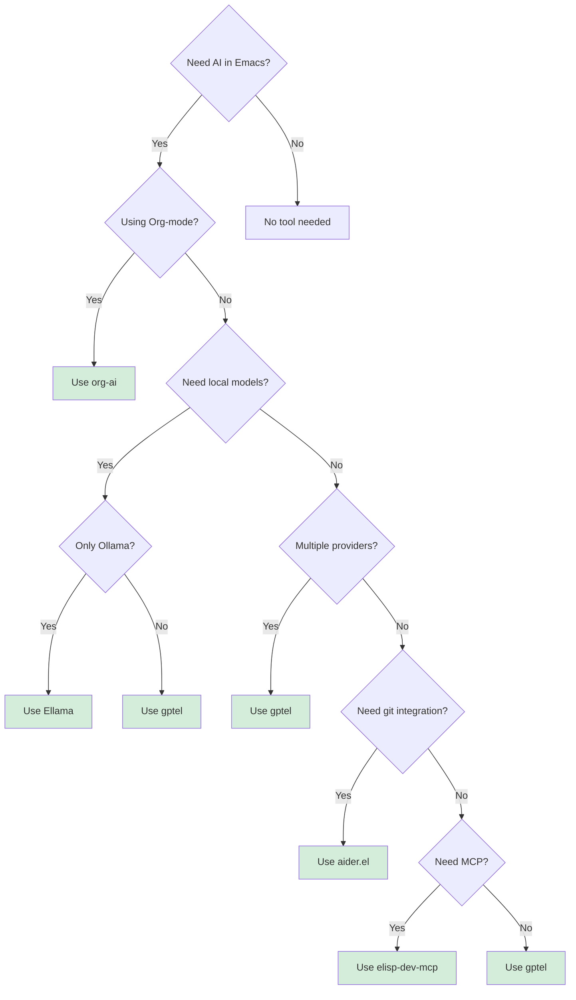

## Integration Patterns

### Pattern 1: Direct API Integration (gptel, org-ai)

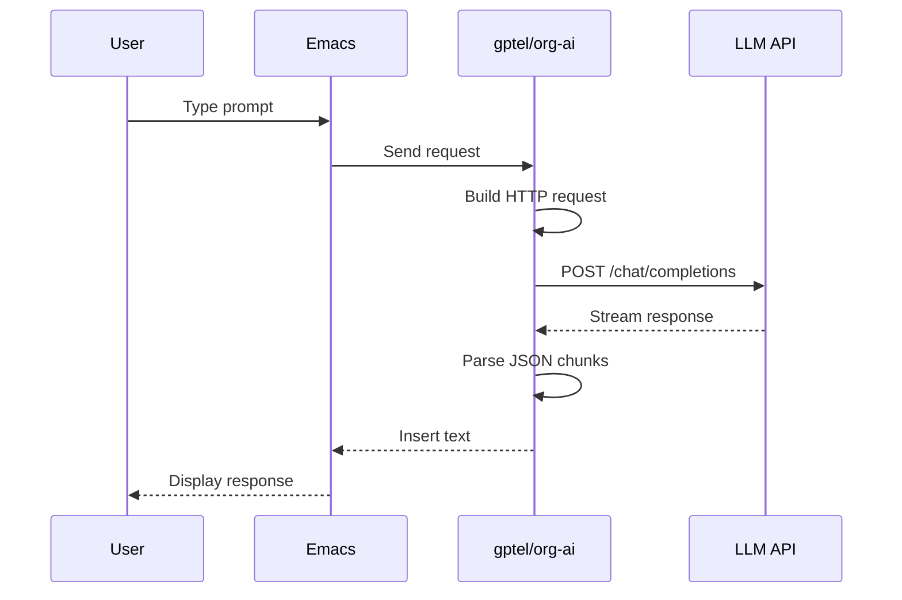

### Pattern 2: Local Model Integration (Ellama)

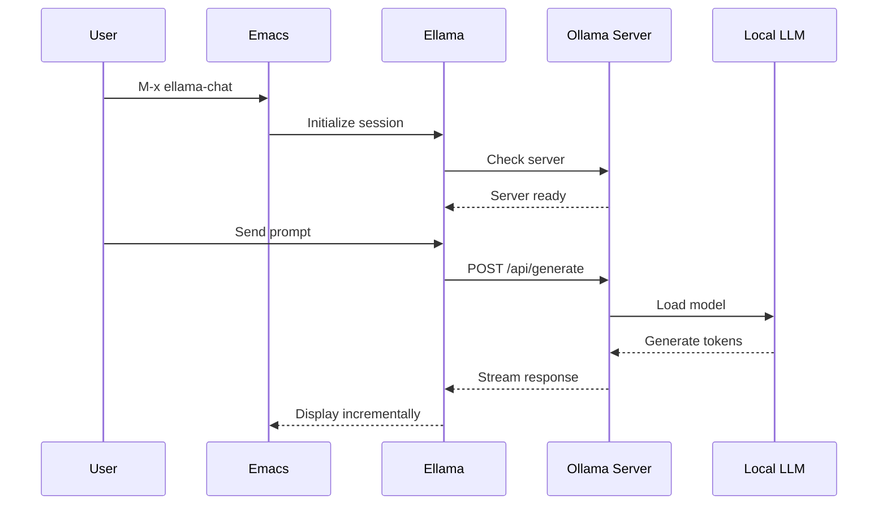

### Pattern 3: External Tool Integration (aider.el)

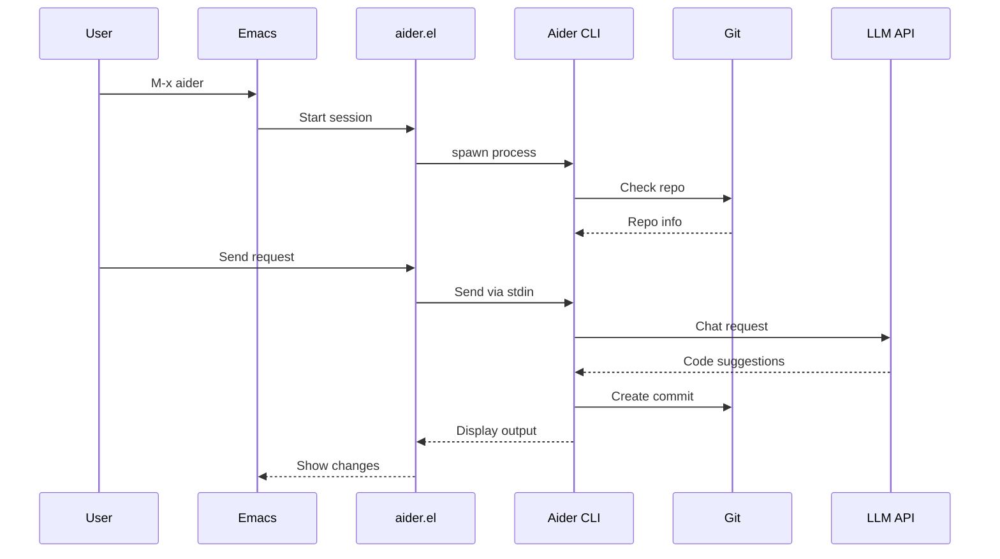

### Pattern 4: MCP Server (elisp-dev-mcp)

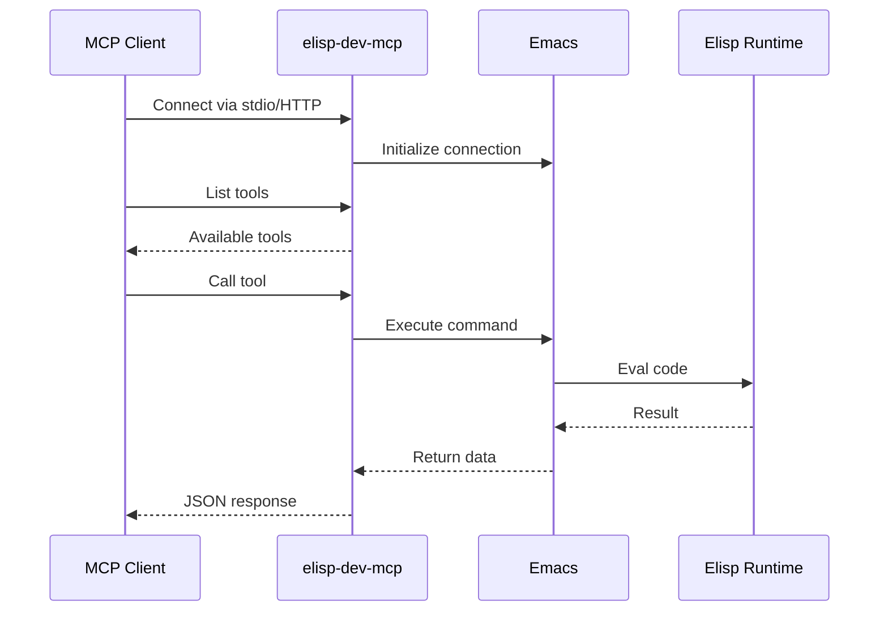

## Data Flow

### Request/Response Flow

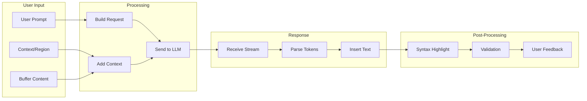

### Context Management Flow

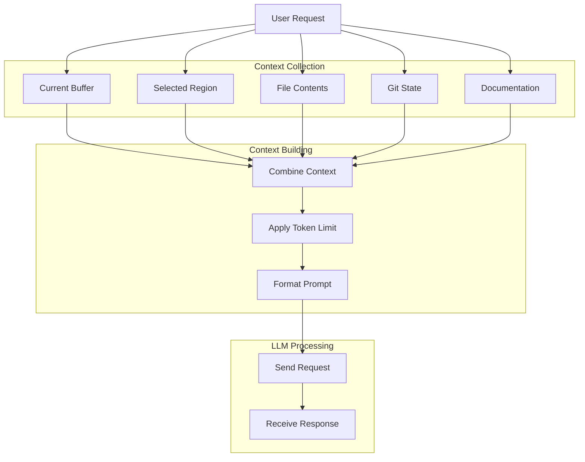

## Common Workflows

### Workflow 1: Code Generation with gptel

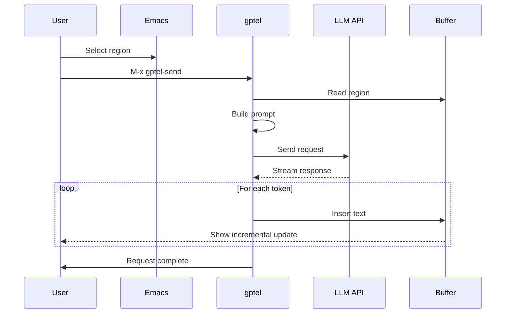

### Workflow 2: Org-mode AI Interaction

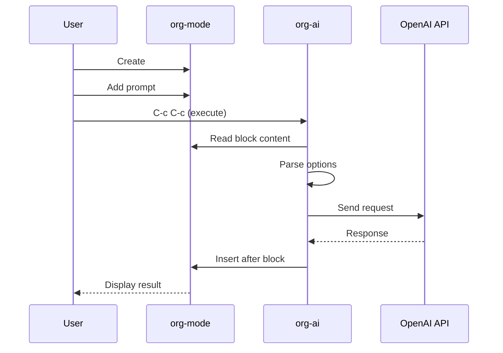

### Workflow 3: Ollama Chat with Ellama

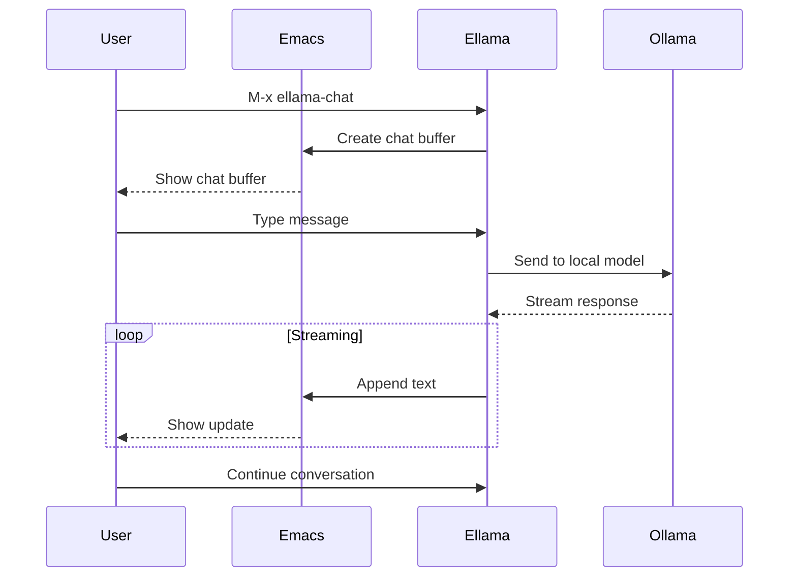

### Workflow 4: AI Pair Programming with aider.el

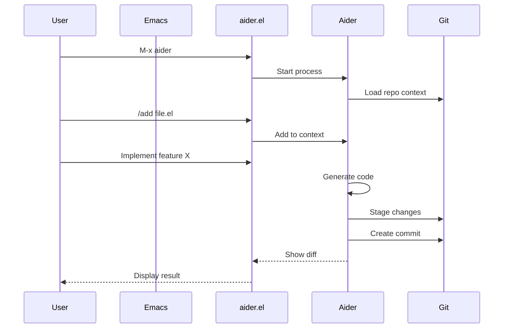

### Workflow 5: Testing with Mock Framework (gptel)

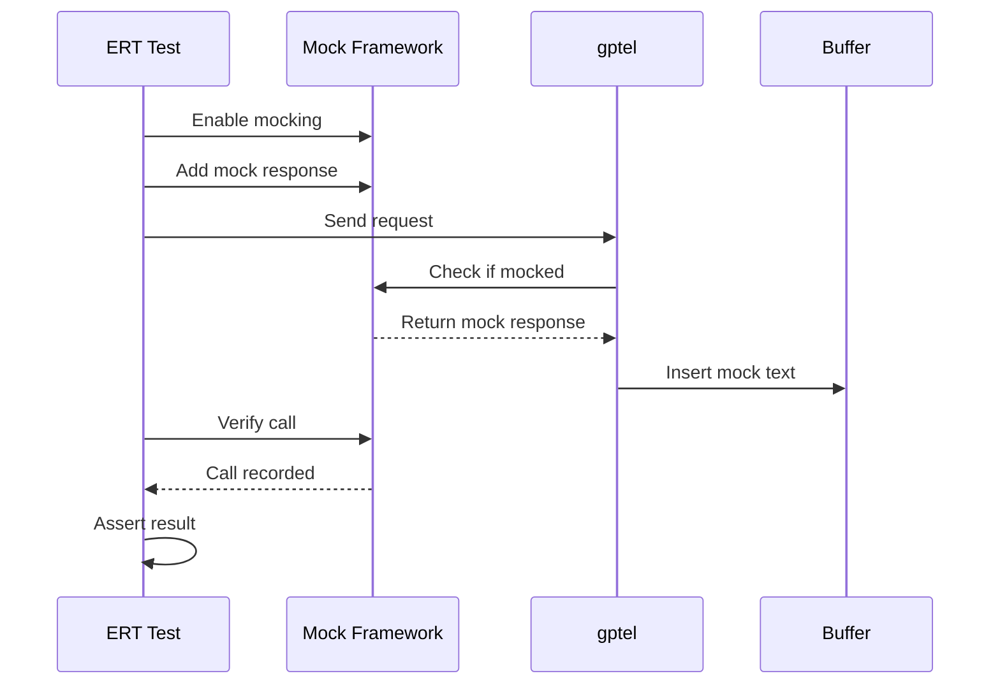

## Component Details

For detailed information about each component:

- [gptel Architecture](Gptel#architecture)
- [org-ai Architecture](Org-AI#architecture)
- [Ellama Architecture](Ellama#architecture)
- [aider.el Architecture](Aider-el#architecture)
- [elisp-dev-mcp Architecture](Elisp-Dev-MCP#architecture)

## Performance Considerations

### Latency Comparison

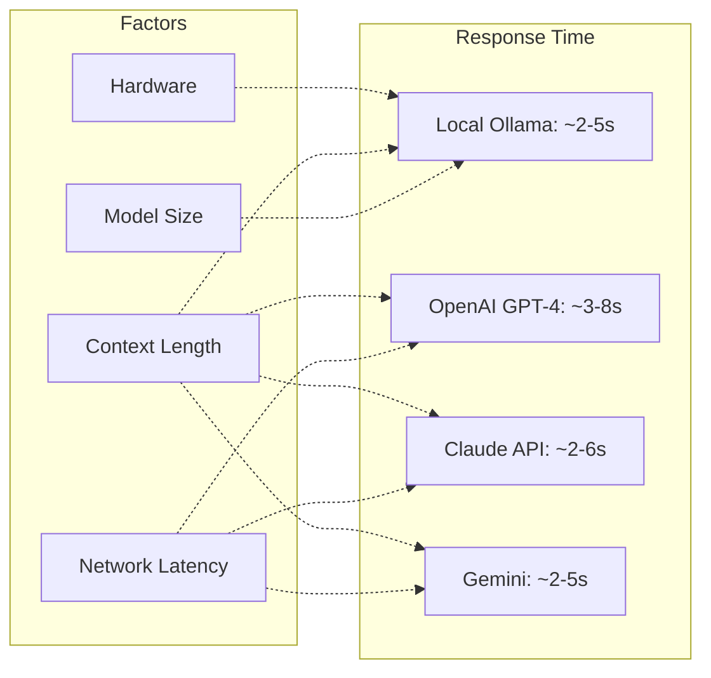

---

**Navigation**: [Home](Home) | [Component Comparison](#component-comparison)
