# elisp-dev-mcp

**elisp-dev-mcp** is a Model Context Protocol (MCP) server that enables AI assistants to interact with Emacs Lisp development environments.

## Table of Contents

- [Overview](#overview)
- [Architecture](#architecture)
- [Features](#features)
- [Setup](#setup)
- [Usage Examples](#usage-examples)
- [Protocol Details](#protocol-details)
- [Resources](#resources)

## Overview

elisp-dev-mcp implements the Model Context Protocol to expose Emacs Lisp development capabilities to AI assistants like Claude Desktop, enabling programmatic access to Emacs functionality.

### Key Capabilities

- Access and manipulate Emacs Lisp code
- Query Emacs documentation
- Interact with Emacs buffers and processes
- Execute Elisp code in Emacs environment
- Assist with Elisp development workflows
- Bridge between AI assistants and Emacs

## Architecture

### High-Level Architecture

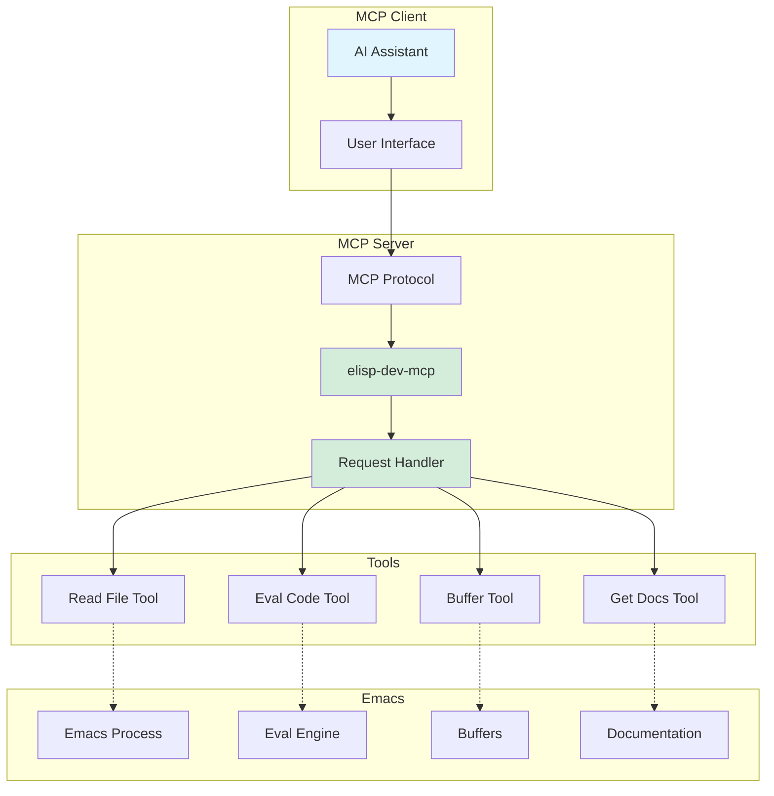

### MCP Protocol Flow

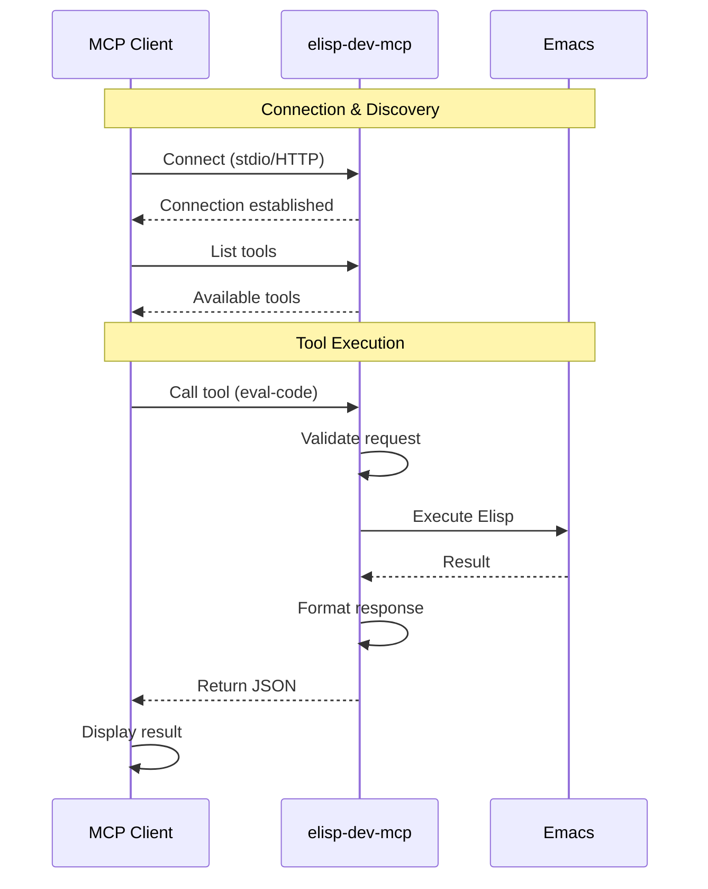

### Tool Architecture

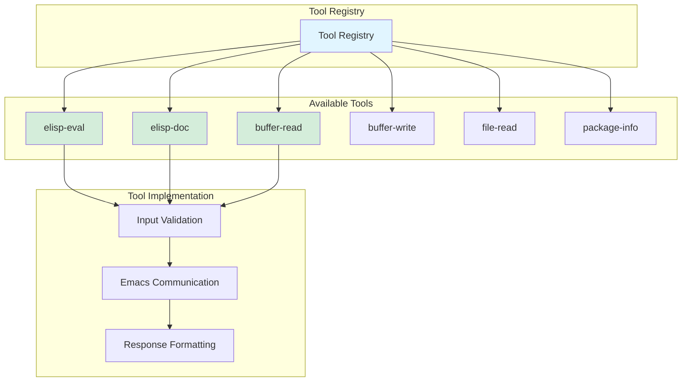

## Features

### MCP Tools

| Tool | Description | Input | Output |
|------|-------------|-------|--------|
| `elisp-eval` | Evaluate Elisp code | Code string | Evaluation result |
| `elisp-doc` | Get documentation | Symbol name | Doc string |
| `buffer-read` | Read buffer contents | Buffer name | Buffer text |
| `buffer-write` | Write to buffer | Buffer name, text | Success status |
| `file-read` | Read Elisp file | File path | File contents |
| `package-info` | Get package info | Package name | Package metadata |

### Communication Modes

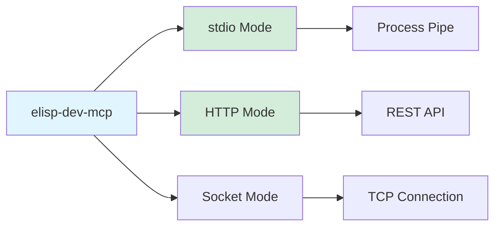

### Protocol Support

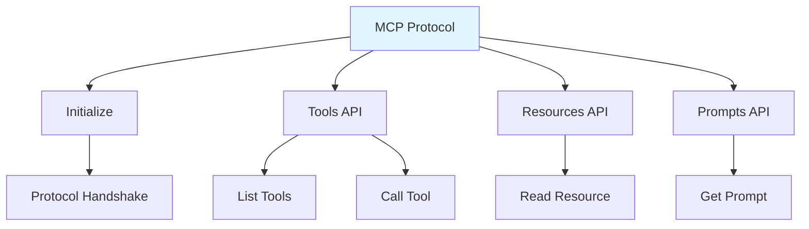

## Setup

### Prerequisites

1. Node.js (for MCP server)
2. Emacs (running instance)
3. MCP-compatible client (e.g., Claude Desktop)

### Installation

```bash
# Clone the repository
git clone https://github.com/ppbb/elisp-dev-mcp
cd elisp-dev-mcp

# Install dependencies
npm install

# Build the server
npm run build
```

### Emacs Configuration

```elisp
;; Optional: Configure Emacs to work with MCP server
;; The server communicates with Emacs via process

;; Enable server if needed
(server-start)

;; Configure any specific settings for MCP integration
```

### MCP Client Configuration

For Claude Desktop, add to `claude_desktop_config.json`:

```json
{
  "mcpServers": {
    "elisp-dev": {
      "command": "node",
      "args": ["/path/to/elisp-dev-mcp/build/index.js"],
      "env": {
        "EMACS_SERVER_NAME": "server"
      }
    }
  }
}
```

### Configuration Options

```json
{
  "mcpServers": {
    "elisp-dev": {
      "command": "node",
      "args": ["/path/to/elisp-dev-mcp/build/index.js"],
      "env": {
        "EMACS_SERVER_NAME": "server",
        "EMACS_SOCKET_PATH": "/path/to/socket",
        "LOG_LEVEL": "debug"
      }
    }
  }
}
```

## Usage Examples

### Example 1: Evaluate Code

```javascript
// Client request
{
  "method": "tools/call",
  "params": {
    "name": "elisp-eval",
    "arguments": {
      "code": "(+ 2 2)"
    }
  }
}

// Server response
{
  "result": "4"
}
```

### Example 2: Get Documentation

```javascript
// Request
{
  "method": "tools/call",
  "params": {
    "name": "elisp-doc",
    "arguments": {
      "symbol": "defun"
    }
  }
}

// Response
{
  "result": "Define a function with NAME, ARGLIST, and BODY..."
}
```

### Example 3: Read Buffer

```javascript
// Request
{
  "method": "tools/call",
  "params": {
    "name": "buffer-read",
    "arguments": {
      "buffer": "*scratch*"
    }
  }
}

// Response
{
  "result": ";; This buffer is for notes..."
}
```

## Protocol Details

### Request/Response Flow

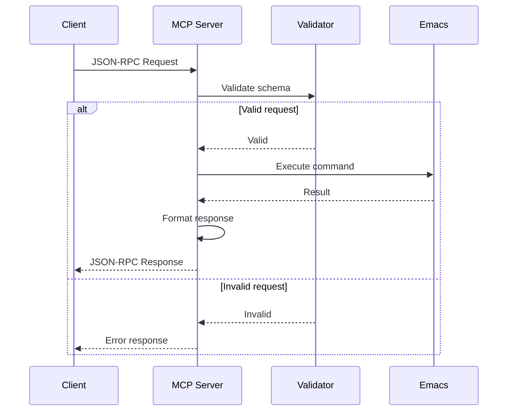

### Tool Call Lifecycle

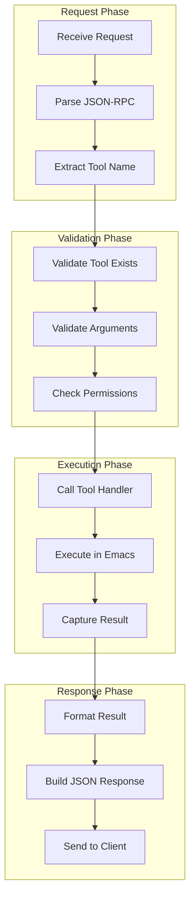

### Error Handling

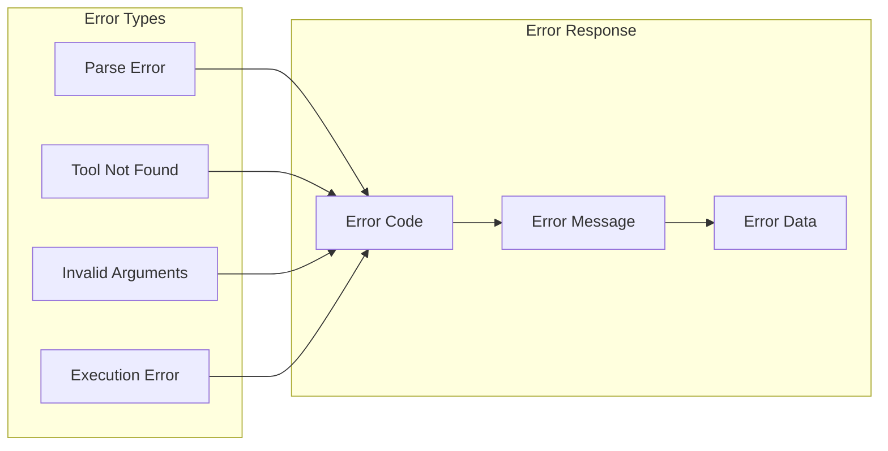

## Workflows

### Development Assistant Workflow

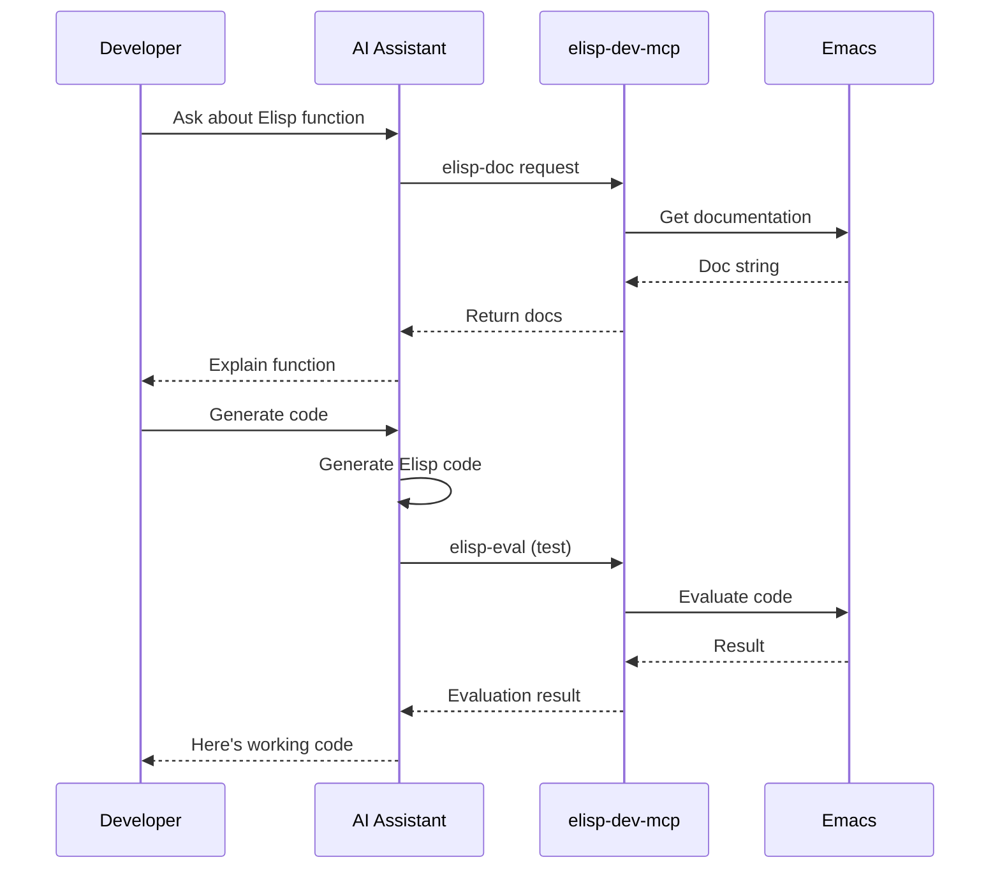

### Code Review Workflow

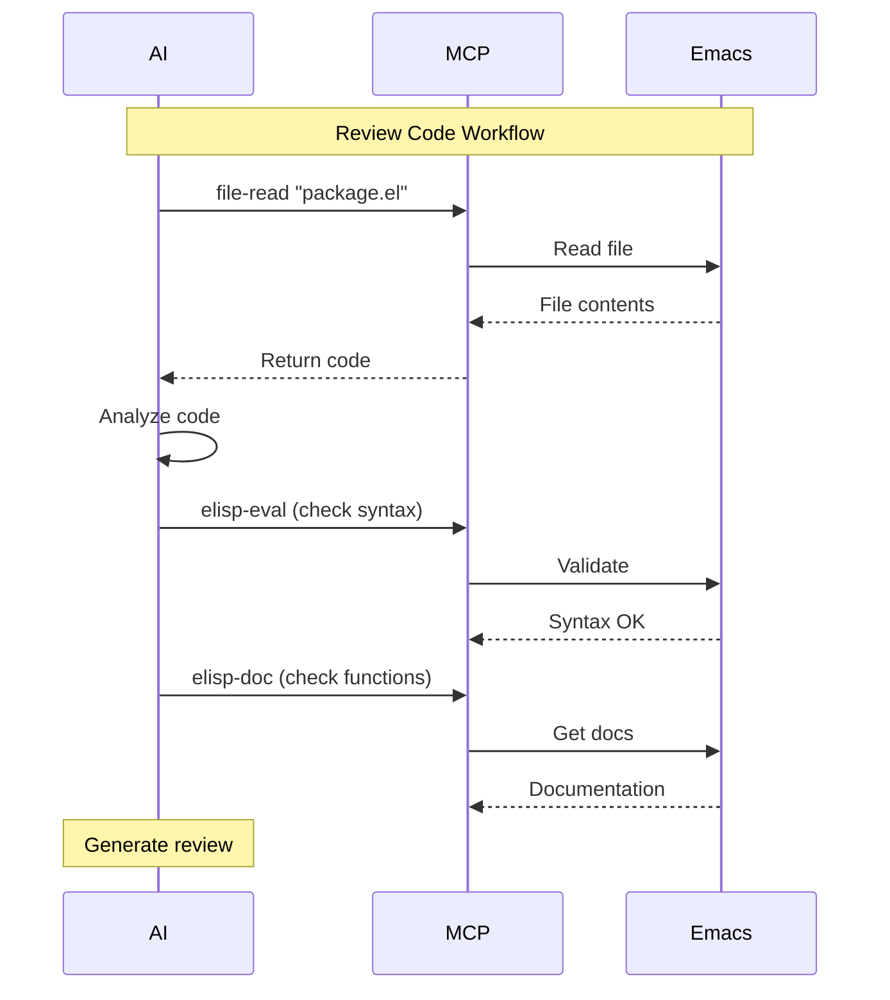

### Interactive Development

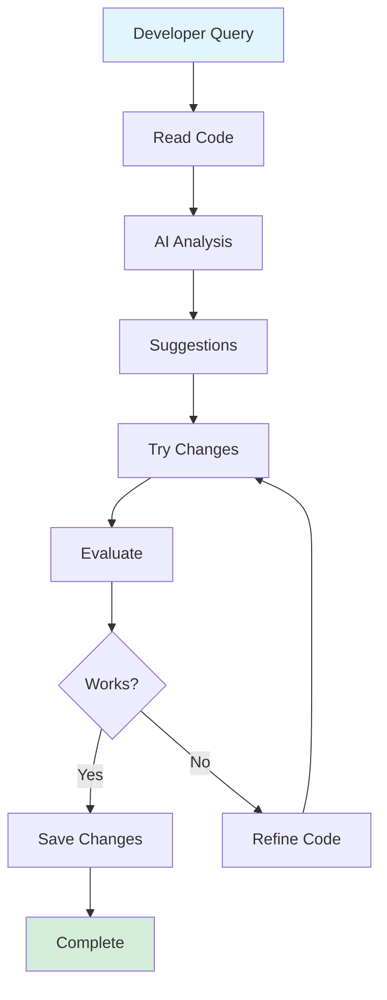

## Data Flow

### Request Processing

```mermaid
graph LR
    subgraph "Input"
        A[JSON-RPC Request]
        B[Method Name]
        C[Parameters]
    end

    subgraph "Processing"
        D[Route to Handler]
        E[Extract Arguments]
        F[Build Emacs Command]
    end

    subgraph "Execution"
        G[Send to Emacs]
        H[Wait for Response]
        I[Parse Result]
    end

    subgraph "Output"
        J[Format JSON]
        K[Add Metadata]
        L[Return Response]
    end

    A --> B
    B --> C
    C --> D

    D --> E
    E --> F
    F --> G

    G --> H
    H --> I
    I --> J

    J --> K
    K --> L
```

### Emacs Communication

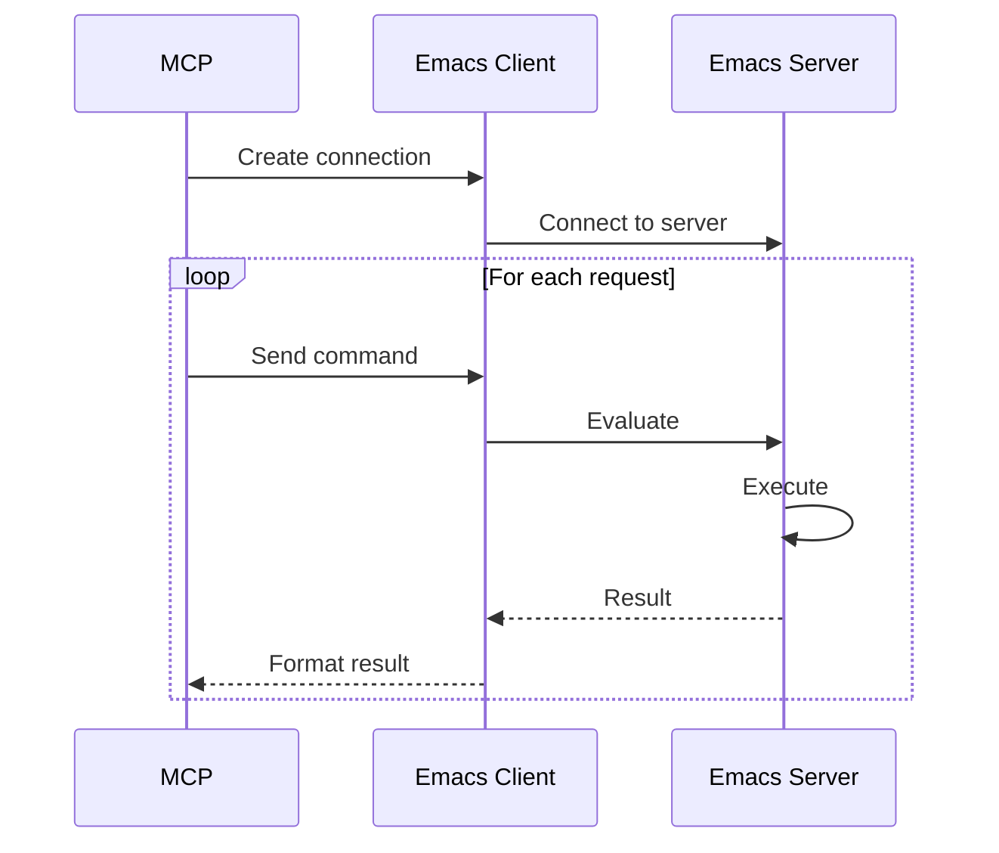

## Advanced Features

### Resource Management

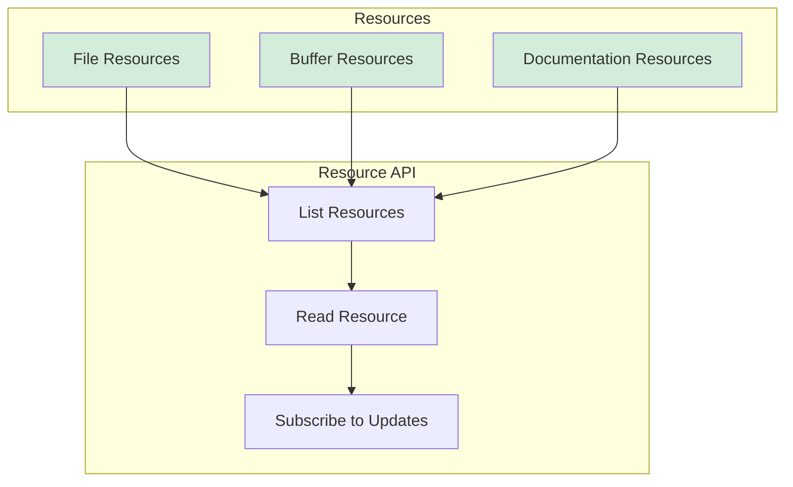

### Prompt Templates

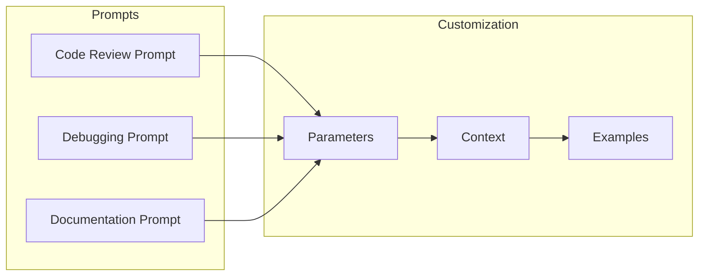

## Security Considerations

### Access Control

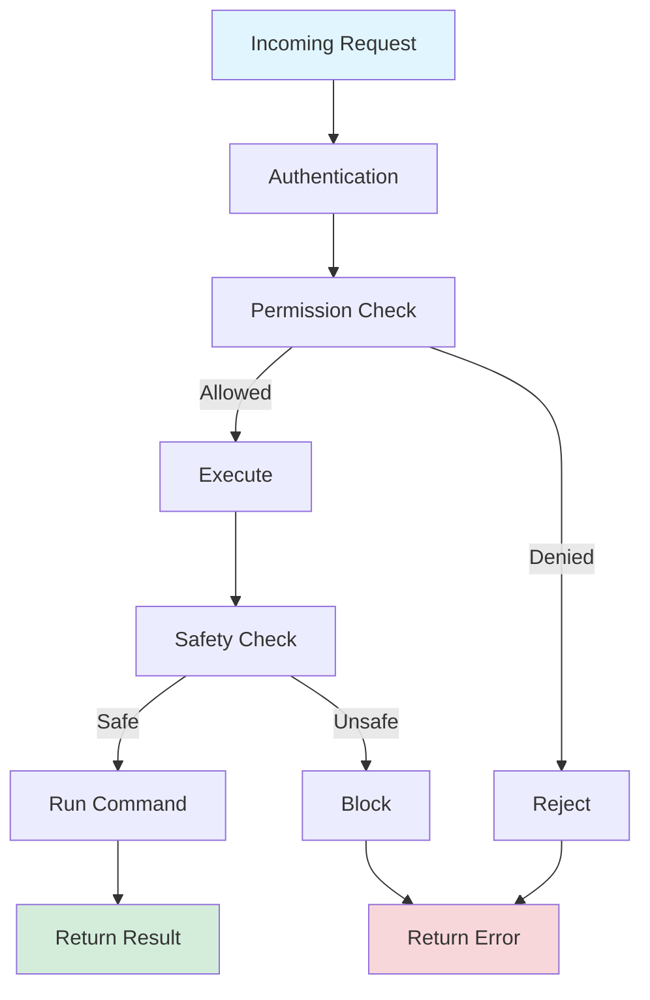

### Sandboxing

- Limit file system access
- Restrict dangerous functions
- Validate all inputs
- Monitor resource usage
- Log all operations

## Advantages

- **Standardized Protocol**: Uses MCP standard
- **AI Integration**: Easy AI assistant integration
- **Emacs Access**: Direct Emacs functionality access
- **Extensible**: Easy to add new tools
- **Language Agnostic**: Works with any MCP client

## Limitations

- **Requires Running Emacs**: Emacs must be active
- **Security Concerns**: Remote code execution risks
- **Setup Complexity**: Requires MCP client configuration
- **Network Overhead**: Communication latency
- **Limited to MCP Clients**: Not all AI tools support MCP

## Best Practices

1. **Security First**: Validate all inputs
2. **Error Handling**: Provide clear error messages
3. **Documentation**: Document all tools clearly
4. **Testing**: Test with various clients
5. **Monitoring**: Log operations for debugging

## Resources

### Documentation

- [elisp-dev-mcp GitHub Repository](https://github.com/ppbb/elisp-dev-mcp)
- [MCP Documentation](https://modelcontextprotocol.io/)
- [MCP Specification](https://spec.modelcontextprotocol.io/)
- [Demo Project](../../tree/master/demo-elisp-dev-mcp)

### MCP Resources

- [MCP Getting Started](https://modelcontextprotocol.io/getting-started)
- [MCP Protocol Specification](https://spec.modelcontextprotocol.io/specification/)
- [MCP TypeScript SDK](https://github.com/modelcontextprotocol/typescript-sdk)

### Related Documentation

- [Elisp Development Guide](../../blob/master/docs/elisp-development.md)
- [Emacs Client/Server Documentation](https://www.gnu.org/software/emacs/manual/html_node/emacs/Emacs-Server.html)

### Example Integrations

- [Claude Desktop MCP Setup](https://modelcontextprotocol.io/docs/tools/claude-desktop)
- [Other MCP Servers](https://github.com/modelcontextprotocol/servers)

---

**Navigation**: [Home](Home) | [Architecture](Architecture) | [aider.el](Aider-el) | [gptel](Gptel)
