# Ellama

**Ellama** is an Emacs tool for interacting with Large Language Models using Ollama, providing seamless integration with local AI models.

## Table of Contents

- [Overview](#overview)
- [Architecture](#architecture)
- [Features](#features)
- [Setup](#setup)
- [Usage Examples](#usage-examples)
- [Workflows](#workflows)
- [Resources](#resources)

## Overview

Ellama brings Ollama-powered local LLMs to Emacs, enabling privacy-focused AI assistance without requiring cloud API keys.

### Key Capabilities

- Interactive LLM sessions directly in Emacs
- Code generation and refactoring
- Text translation and summarization
- Context-aware assistance using local models
- Integration with Ollama model ecosystem
- No API keys required

## Architecture

### Component Architecture

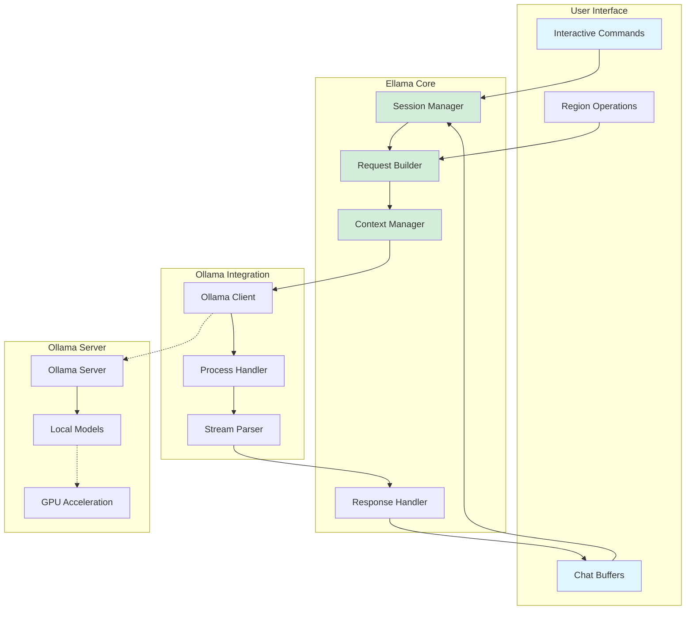

### Request Flow

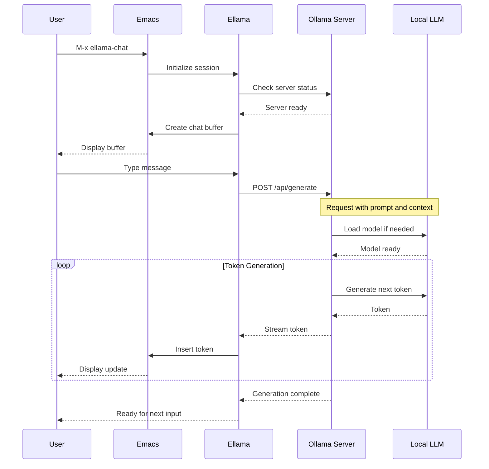

### Model Loading Flow

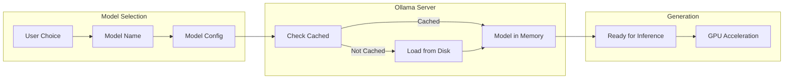

## Features

### Supported Models

Ellama works with any Ollama-compatible model:

| Model Family | Example Models | Use Case |
|--------------|----------------|----------|
| Llama 3 | llama3, llama3.2 | General purpose, coding |
| Mistral | mistral, mixtral | Fast, efficient |
| CodeLlama | codellama | Code generation |
| Phi | phi3 | Lightweight, fast |
| Gemma | gemma | Google's models |

### Interactive Commands

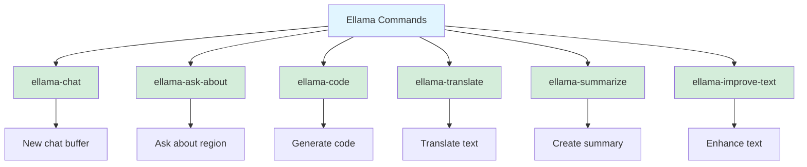

### Operation Modes

| Command | Mode | Input | Output |
|---------|------|-------|--------|
| `ellama-chat` | Interactive | User prompts | Chat buffer |
| `ellama-ask-about` | Query | Region/buffer | New buffer |
| `ellama-code` | Generation | Prompt | Code block |
| `ellama-translate` | Transform | Region | Translation |
| `ellama-summarize` | Reduction | Region/buffer | Summary |
| `ellama-improve-text` | Enhancement | Region | Improved text |

## Setup

### Prerequisites

1. Install Ollama:

```bash
# macOS
brew install ollama

# Linux
curl -fsSL https://ollama.com/install.sh | sh

# Windows
# Download from https://ollama.com/download
```

2. Start Ollama server:

```bash
ollama serve
```

3. Pull a model:

```bash
ollama pull llama3.2
# or
ollama pull mistral
# or
ollama pull codellama
```

### Emacs Configuration

```elisp
;; Install Ellama
(use-package ellama
  :ensure t
  :config
  ;; Set provider to Ollama
  (require 'llm-ollama)

  (setq ellama-provider
        (make-llm-ollama
         :chat-model "llama3.2"
         :embedding-model "nomic-embed-text"))

  ;; Optional: Configure additional settings
  (setq ellama-language "English")
  (setq ellama-sessions-directory
        (expand-file-name "ellama-sessions" user-emacs-directory)))
```

### Advanced Configuration

```elisp
;; Multiple models for different tasks
(setq ellama-providers
      '((chat . ,(make-llm-ollama :chat-model "llama3.2"))
        (code . ,(make-llm-ollama :chat-model "codellama"))
        (translate . ,(make-llm-ollama :chat-model "mistral"))))

;; Custom naming template
(setq ellama-naming-scheme 'ellama-generate-name-by-llm)

;; Auto-save sessions
(setq ellama-auto-save t)
```

## Usage Examples

### Example 1: Chat Session

```elisp
;; Start a chat
M-x ellama-chat

;; In the chat buffer, type your questions:
;; "Explain how closures work in Emacs Lisp"
;; Press RET to send

;; The response streams in real-time
```

### Example 2: Code Generation

```elisp
;; Generate code with a prompt
M-x ellama-code

;; Prompt: "Write a function to sort a list of numbers"
;; Ellama generates the code in a new buffer
```

### Example 3: Text Improvement

```elisp
;; Select a region of text
;; Run: M-x ellama-improve-text

;; Ellama rewrites the text with improvements
```

### Example 4: Translation

```elisp
;; Select text to translate
M-x ellama-translate

;; Choose target language: Spanish
;; Ellama provides translation
```

## Workflows

### Code Development Workflow

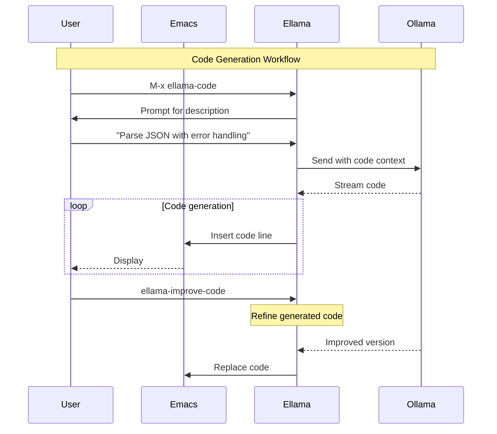

### Document Workflow

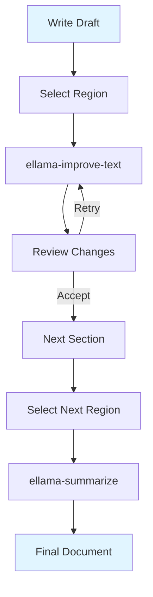

### Research Workflow

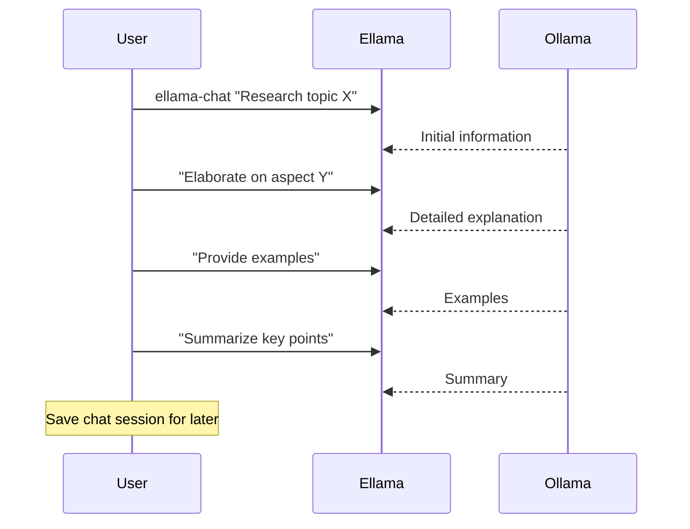

## Data Flow

### Context Building

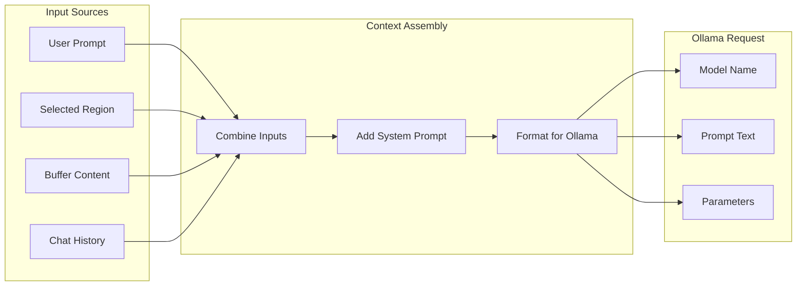

### Response Processing

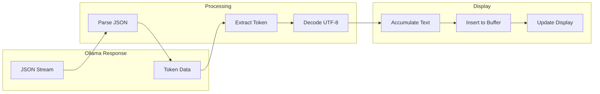

## Advanced Features

### Session Management

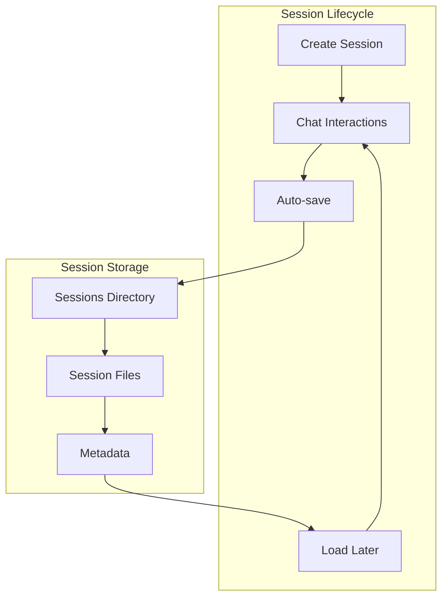

### Model Switching

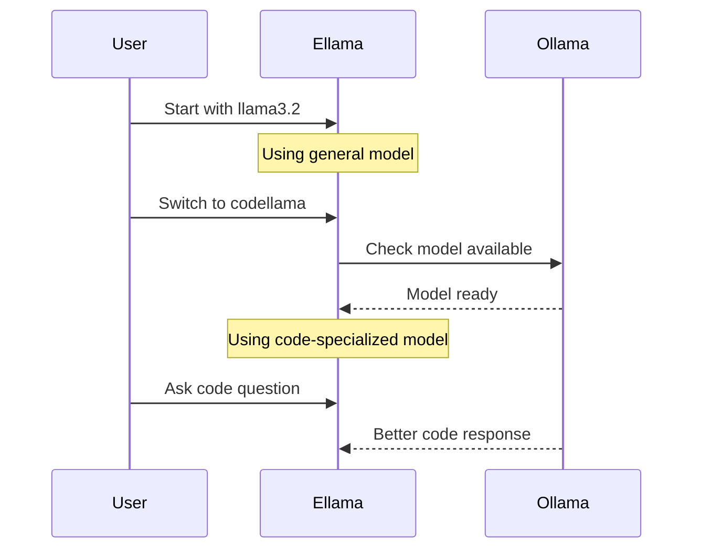

## Performance Characteristics

### Response Time Factors

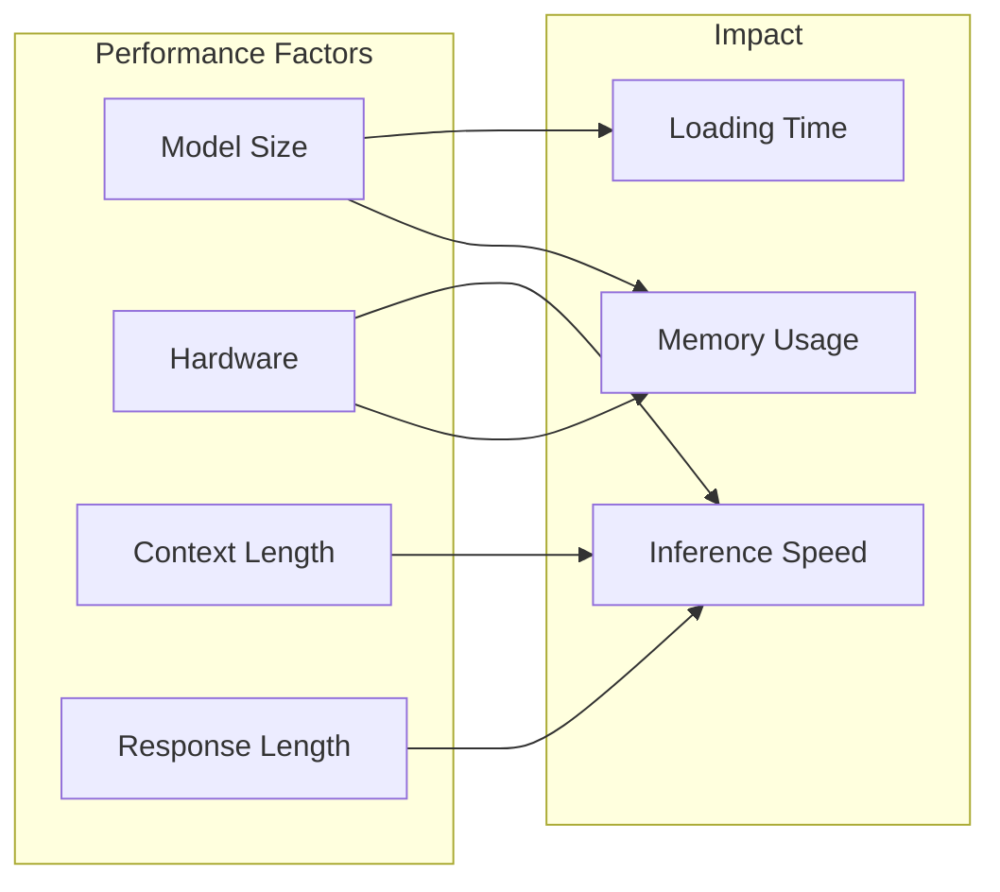

### Optimization Tips

- Use smaller models for faster responses (phi3, mistral)
- Use specialized models for specific tasks (codellama for code)
- Limit context length when possible
- Use GPU acceleration if available
- Keep frequently-used models loaded

## Advantages

- **Privacy**: All processing happens locally
- **No Cost**: No API fees
- **Offline**: Works without internet
- **Customizable**: Use any Ollama model
- **Fast**: Local inference, no network latency

## Limitations

- **Hardware**: Requires sufficient RAM/GPU
- **Model Quality**: Depends on local model capabilities
- **Setup**: Requires Ollama installation
- **Single Provider**: Only works with Ollama

## Resources

### Documentation

- [Ellama GitHub Repository](https://github.com/s-kostyaev/ellama)
- [Ollama Documentation](https://github.com/ollama/ollama)
- [Ollama Model Library](https://ollama.com/library)
- [Demo Project](../../tree/master/demo-ellama)

### Ollama Resources

- [Ollama Installation](https://ollama.com/download)
- [Model Quantization Guide](https://github.com/ollama/ollama/blob/main/docs/quantization.md)
- [GPU Support](https://github.com/ollama/ollama/blob/main/docs/gpu.md)

### Related Documentation

- [Elisp Development Guide](../../blob/master/docs/elisp-development.md)
- [LLM.el Documentation](https://github.com/ahyatt/llm)

---

**Navigation**: [Home](Home) | [Architecture](Architecture) | [gptel](Gptel) | [org-ai](Org-AI)
