# gptel

**gptel** is a simple, no-frills LLM client for Emacs that supports multiple AI providers including ChatGPT, Claude, Gemini, and local models.

## Table of Contents

- [Overview](#overview)
- [Architecture](#architecture)
- [Features](#features)
- [Setup](#setup)
- [Usage Examples](#usage-examples)
- [Testing Framework](#testing-framework)
- [Resources](#resources)

## Overview

gptel provides a unified interface for interacting with various LLM providers from within Emacs. It supports streaming responses, multiple backends, and includes a comprehensive testing framework with mock support.

### Key Capabilities

- Multi-provider support (OpenAI, Anthropic, Google, local models)
- Streaming responses with real-time display
- Region-based interactions
- Customizable backends
- Mock testing framework
- Integration testing with Ollama

## Architecture

### Component Architecture

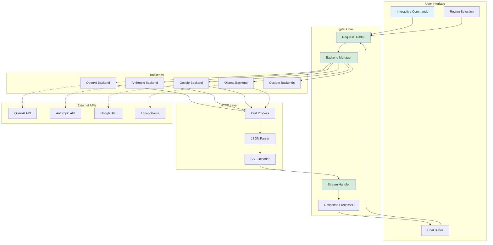

### Request Flow Sequence

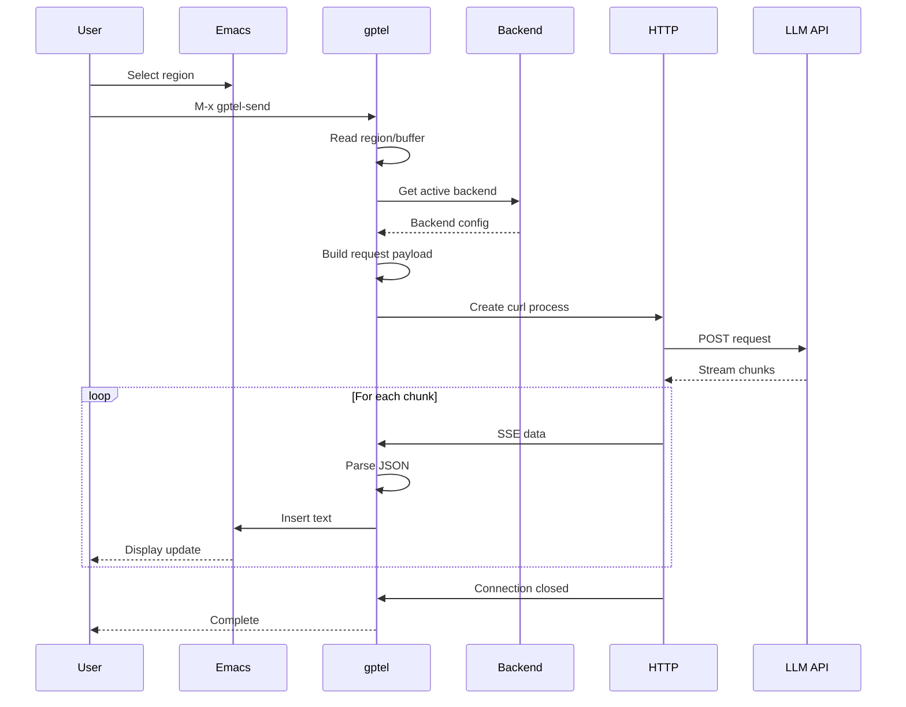

### Backend Configuration Flow

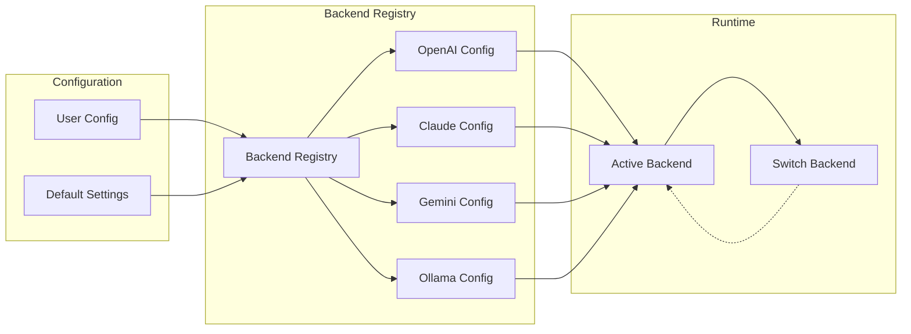

### Testing Architecture

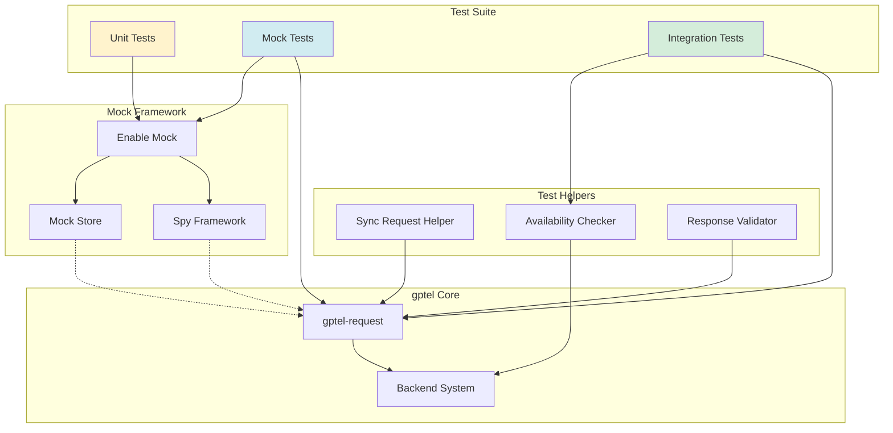

## Features

### Multi-Provider Support

| Provider | Streaming | Models | API Key Required |
|----------|-----------|--------|------------------|
| OpenAI | ✅ | GPT-4, GPT-3.5, etc. | ✅ |
| Anthropic | ✅ | Claude 3, etc. | ✅ |
| Google | ✅ | Gemini Pro, etc. | ✅ |
| Ollama | ✅ | llama3, mistral, etc. | ❌ |
| Llama.cpp | ✅ | Local models | ❌ |

### Interactive Commands

- `gptel-send` - Send region or buffer to LLM
- `gptel` - Start a new chat session
- `gptel-menu` - Transient menu for options
- `gptel-set-backend` - Switch LLM provider

### Response Modes

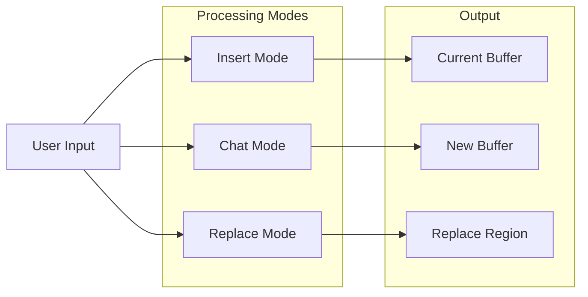

## Setup

### Basic Configuration

```elisp
;; Install from MELPA
(use-package gptel
  :ensure t
  :config
  ;; Set default backend
  (setq gptel-backend 'chatgpt)

  ;; Configure API key
  (setq gptel-api-key "your-api-key-here"))
```

### Multi-Backend Setup

```elisp
;; OpenAI
(setq gptel-backend
      (gptel-make-openai "ChatGPT"
        :key "your-openai-key"
        :models '("gpt-4" "gpt-3.5-turbo")))

;; Anthropic Claude
(setq gptel-backend
      (gptel-make-anthropic "Claude"
        :key "your-anthropic-key"
        :models '("claude-3-opus" "claude-3-sonnet")))

;; Local Ollama
(setq gptel-backend
      (gptel-make-ollama "Ollama"
        :host "localhost:11434"
        :models '("llama3.2" "mistral")
        :stream t))
```

See [demo-gptel/elisp/setup.el](../../blob/master/demo-gptel/elisp/setup.el) for complete configuration examples.

## Usage Examples

### Example 1: Code Generation

```elisp
;; Select a region with a comment like:
;; "Write a function to calculate fibonacci numbers"

;; Then run:
M-x gptel-send

;; gptel will insert the generated code below
```

### Example 2: Code Review

```elisp
;; Select your code region
;; Set a directive: "Review this code for bugs"
M-x gptel-send
```

### Example 3: Chat Session

```elisp
;; Start a chat
M-x gptel

;; Type your questions in the buffer
;; Press C-c RET to send
```

### Workflow Diagram

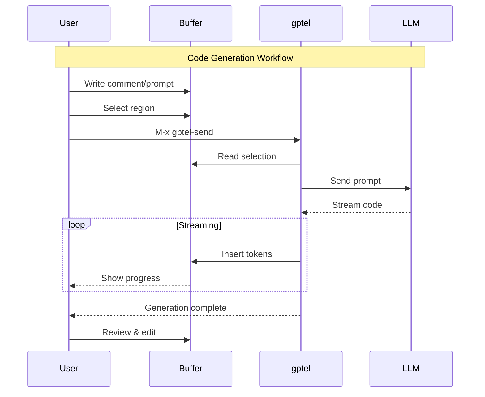

## Testing Framework

The demo-gptel project includes a comprehensive testing framework with three types of tests:

### Test Types

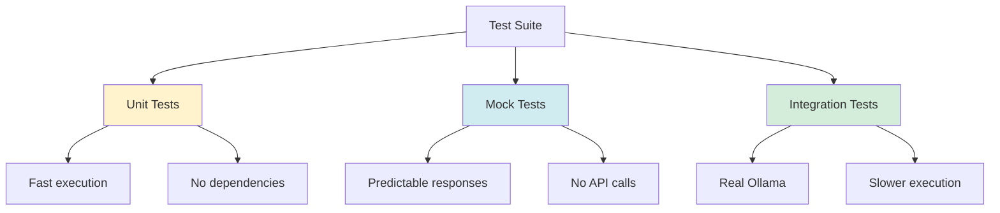

### Mock Testing Flow

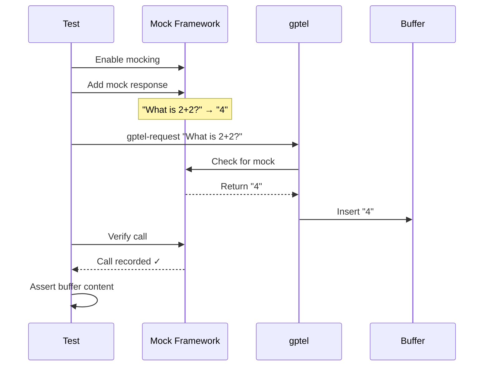

### Running Tests

```bash
# Unit tests only (fast, no dependencies)
cd demo-gptel/tests
emacs -Q -batch -L . -l gptel-ollama-ert.el -f ert-run-tests-batch-and-exit

# Integration tests (requires Ollama)
ollama serve  # In another terminal
emacs -Q --eval "(progn
  (load-file \"gptel-ollama-ert.el\")
  (gptel-test-run-integration))"
```

See [demo-gptel/tests/SETUP-GUIDE.md](../../blob/master/demo-gptel/tests/SETUP-GUIDE.md) for detailed testing documentation.

## Data Flow

### Request Building

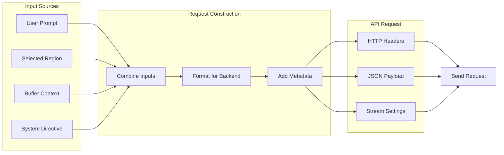

### Response Processing

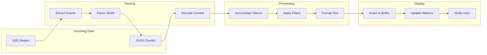

## Advanced Features

### Custom Directives

```elisp
;; Set a system directive
(setq gptel-directives
      '((default . "You are a helpful assistant.")
        (code-review . "Review code for bugs and improvements.")
        (refactor . "Suggest refactorings for better code quality.")))
```

### Context Management

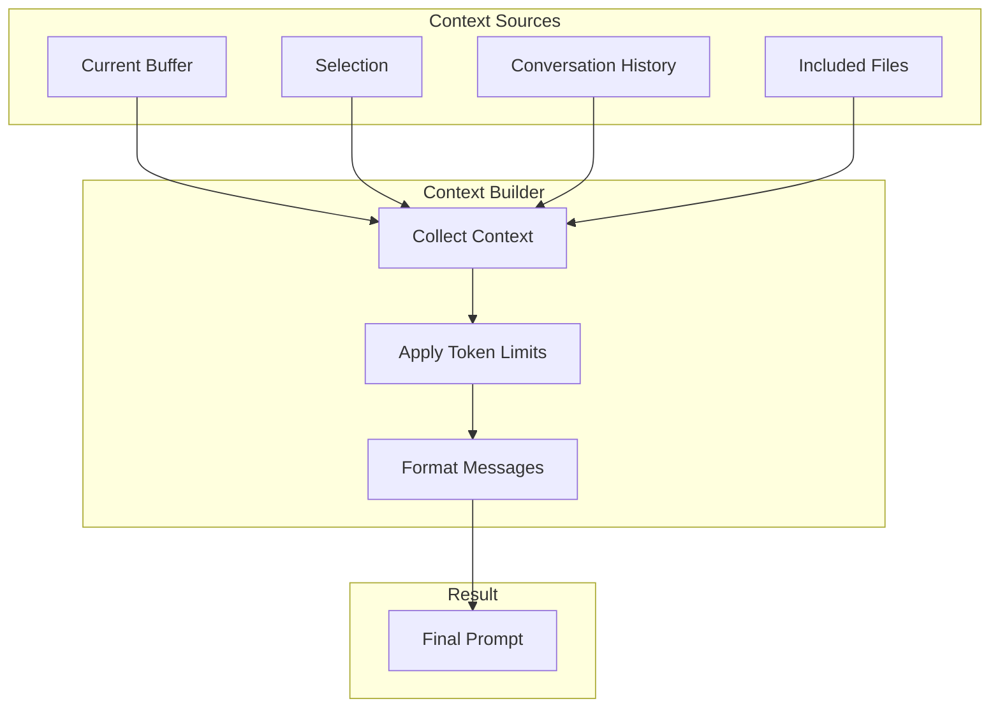

## Resources

### Documentation

- [gptel GitHub Repository](https://github.com/karthink/gptel)
- [gptel Wiki](https://github.com/karthink/gptel/wiki)
- [Demo Project](../../tree/master/demo-gptel)
- [Setup Configuration](../../blob/master/demo-gptel/elisp/setup.el)

### Testing Resources

- [ERT Test Suite](../../blob/master/demo-gptel/tests/gptel-ollama-ert.el)
- [Testing Guide](../../blob/master/demo-gptel/tests/SETUP-GUIDE.md)
- [Test Results](../../blob/master/demo-gptel/tests/results)

### Related Documentation

- [Elisp Development Guide](../../blob/master/docs/elisp-development.md)
- [gptel Babel Demo](../../blob/master/demo-gptel/docs/gptel-babel-demo.org)

---

**Navigation**: [Home](Home) | [Architecture](Architecture) | [All Components](#)
