# org-ai

**org-ai** integrates AI capabilities directly into org-mode, allowing you to use AI within your org documents for various tasks including chat, code generation, text manipulation, and image creation.

## Table of Contents

- [Overview](#overview)
- [Architecture](#architecture)
- [Features](#features)
- [Setup](#setup)
- [Usage Examples](#usage-examples)
- [Integration Patterns](#integration-patterns)
- [Resources](#resources)

## Overview

org-ai brings AI functionality into the heart of org-mode, enabling seamless AI interactions within your documents, notes, and workflows.

### Key Capabilities

- AI chat sessions within org documents
- Inline text generation and completion
- Code generation and refactoring
- Image generation with DALL-E
- Speech input and output
- Native org-mode block syntax

## Architecture

### Component Architecture

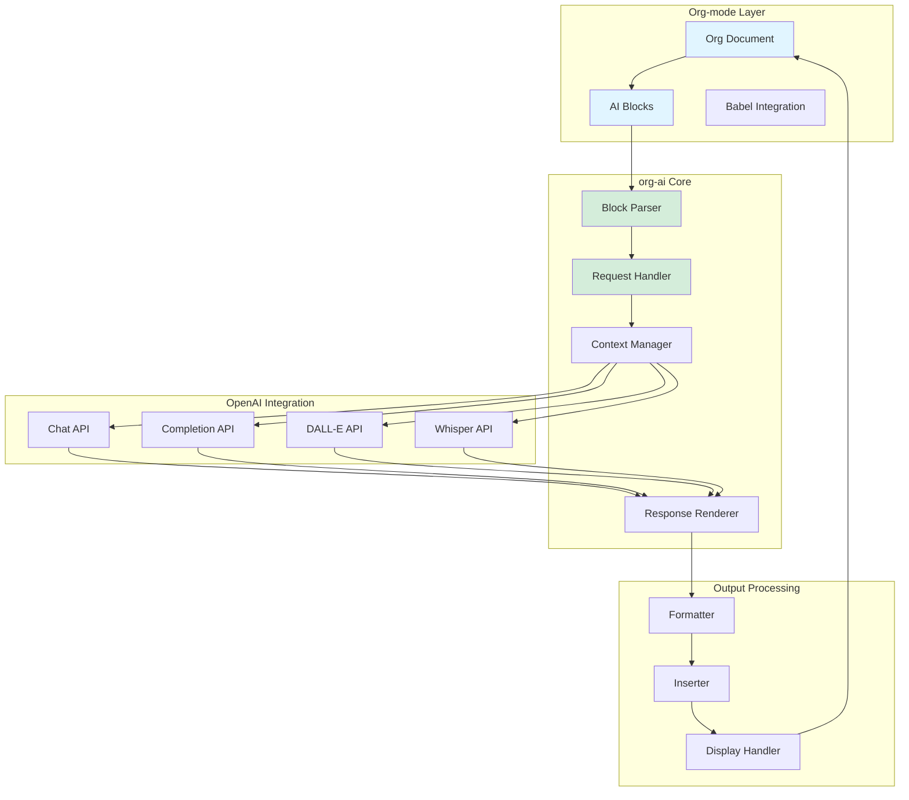

### AI Block Execution Flow

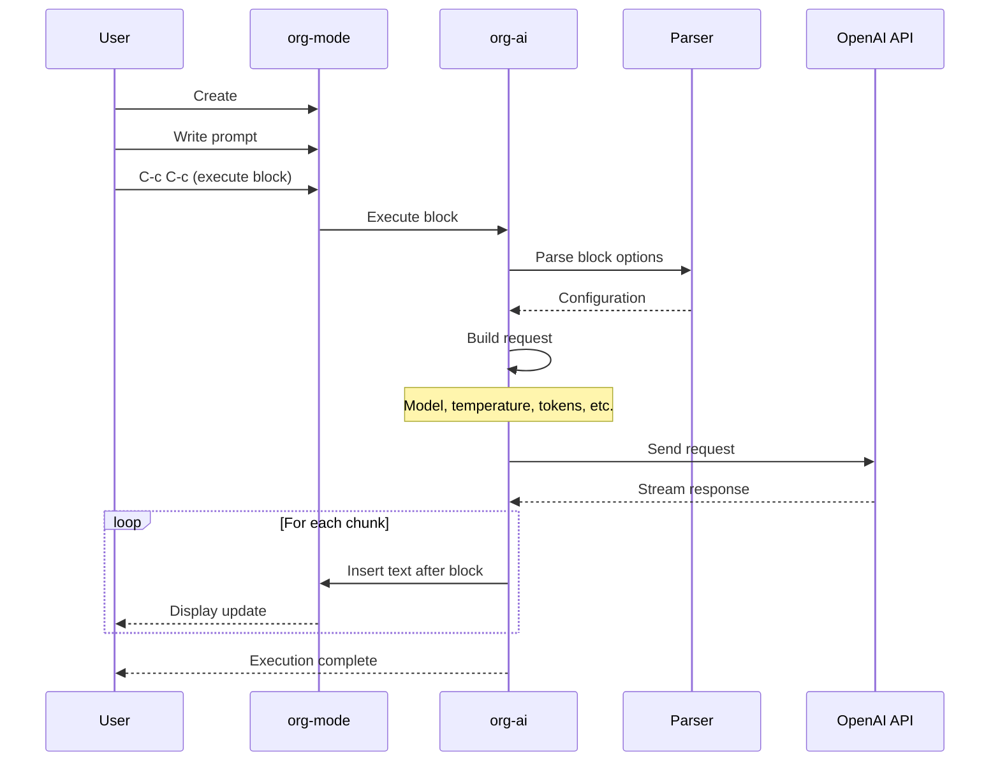

### Block Syntax Processing

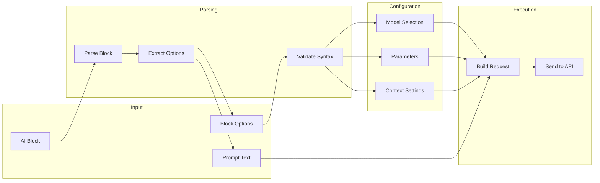

## Features

### AI Block Types

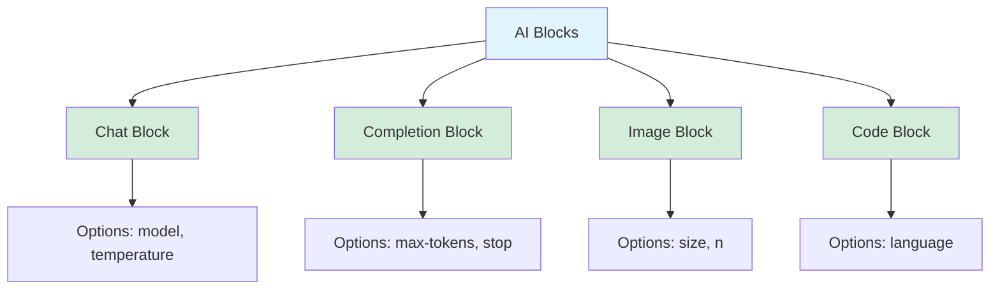

### Supported Operations

| Operation | Description | API Used |
|-----------|-------------|----------|
| Chat | Interactive conversation | Chat Completions |
| Completion | Text generation | Completions |
| Code Generation | Generate code | Chat/Completions |
| Refactoring | Improve code | Chat Completions |
| Image Generation | Create images | DALL-E |
| Speech-to-Text | Transcribe audio | Whisper |
| Text-to-Speech | Generate audio | TTS |

### Block Options

```elisp
;; Example block with options
#+begin_ai :model "gpt-4" :temperature 0.7 :max-tokens 500
What is the capital of France?
#+end_ai
```

Options include:
- `:model` - Model to use
- `:temperature` - Creativity level (0-2)
- `:max-tokens` - Maximum response length
- `:top-p` - Nucleus sampling
- `:frequency-penalty` - Reduce repetition
- `:presence-penalty` - Encourage new topics

## Setup

### Installation

```elisp
;; Install from MELPA
(use-package org-ai
  :ensure t
  :hook (org-mode . org-ai-mode)
  :config
  ;; Set your OpenAI API key
  (setq org-ai-openai-api-token "your-api-key-here")

  ;; Optional: Set default model
  (setq org-ai-default-chat-model "gpt-4"))
```

### Configuration Options

```elisp
;; Customize behavior
(setq org-ai-default-chat-model "gpt-4"
      org-ai-default-max-tokens 1000
      org-ai-default-temperature 0.7
      org-ai-talk-spoken-input t
      org-ai-talk-say-words-aloud t)

;; Key bindings
(use-package org-ai
  :bind (:map org-mode-map
              ("C-c M-a" . org-ai-mode)
              ("C-c M-c" . org-ai-chat)))
```

## Usage Examples

### Example 1: Simple Chat

```org
#+begin_ai
Explain how closures work in Emacs Lisp.
#+end_ai

;; Press C-c C-c to execute
;; Response appears below the block
```

### Example 2: Code Generation

```org
#+begin_ai :model "gpt-4"
Write an Emacs Lisp function that:
- Takes a list of numbers
- Returns only the even numbers
- Uses lexical binding
#+end_ai
```

### Example 3: Code Review

```org
#+begin_ai :model "gpt-4" :temperature 0.3
Review this code for bugs:

(defun my-function (items)
  (loop for item in items
        collect (process item)))
#+end_ai
```

### Example 4: Image Generation

```org
#+begin_ai :image :size "1024x1024"
A serene landscape with mountains and a lake at sunset
#+end_ai
```

### Workflow Diagrams

#### Chat Workflow

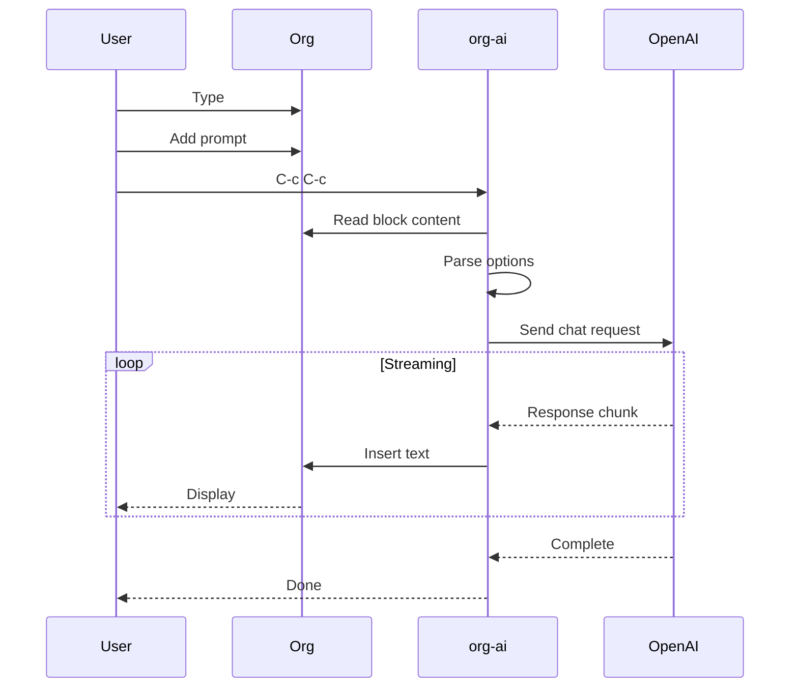

#### Multi-Turn Conversation

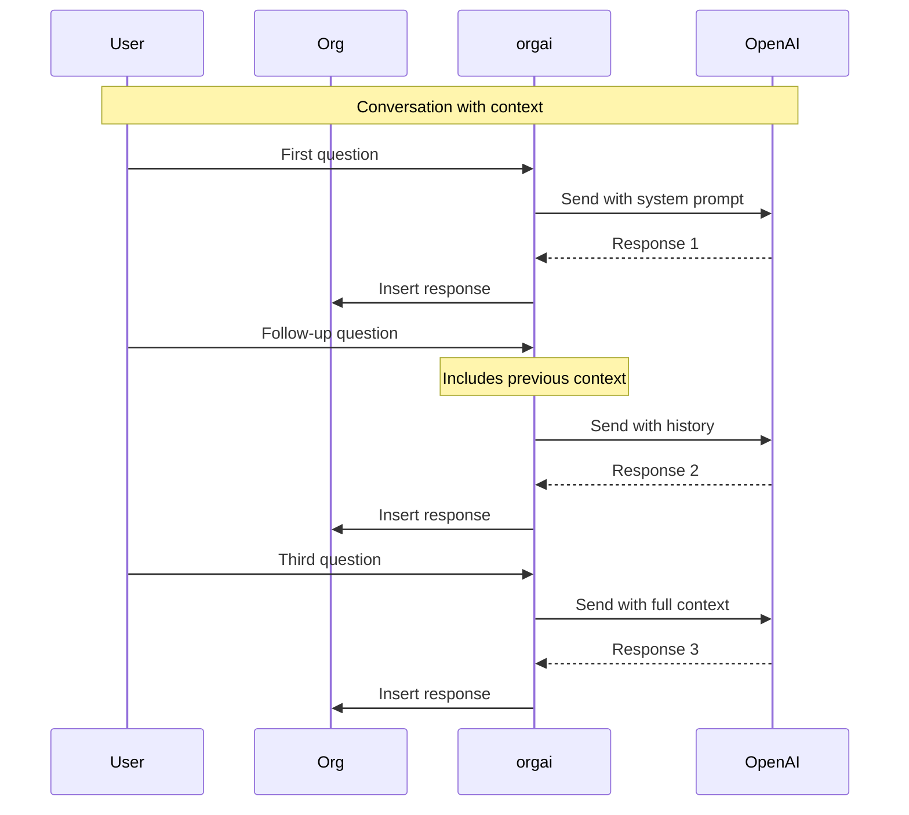

## Integration Patterns

### Pattern 1: Document Enhancement

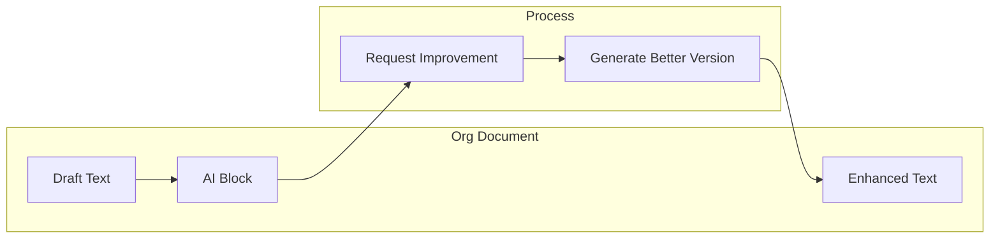

### Pattern 2: Research Workflow

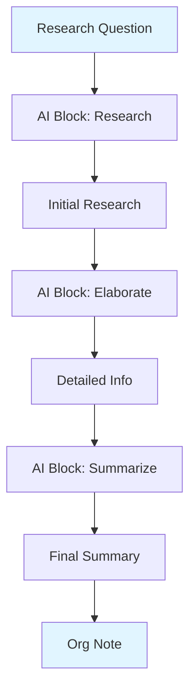

### Pattern 3: Code Development

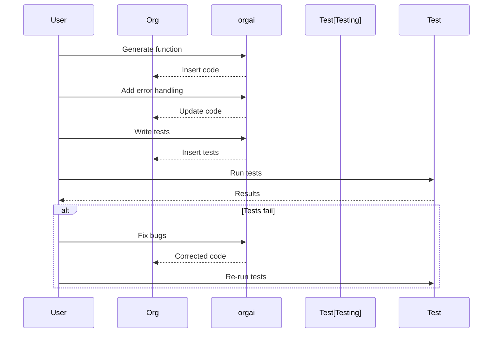

## Data Flow

### Request Construction

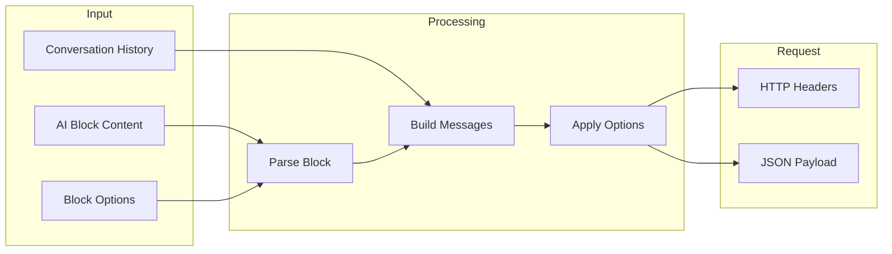

### Response Integration

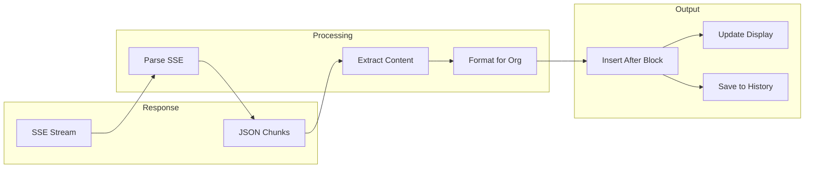

## Advanced Features

### Context Management

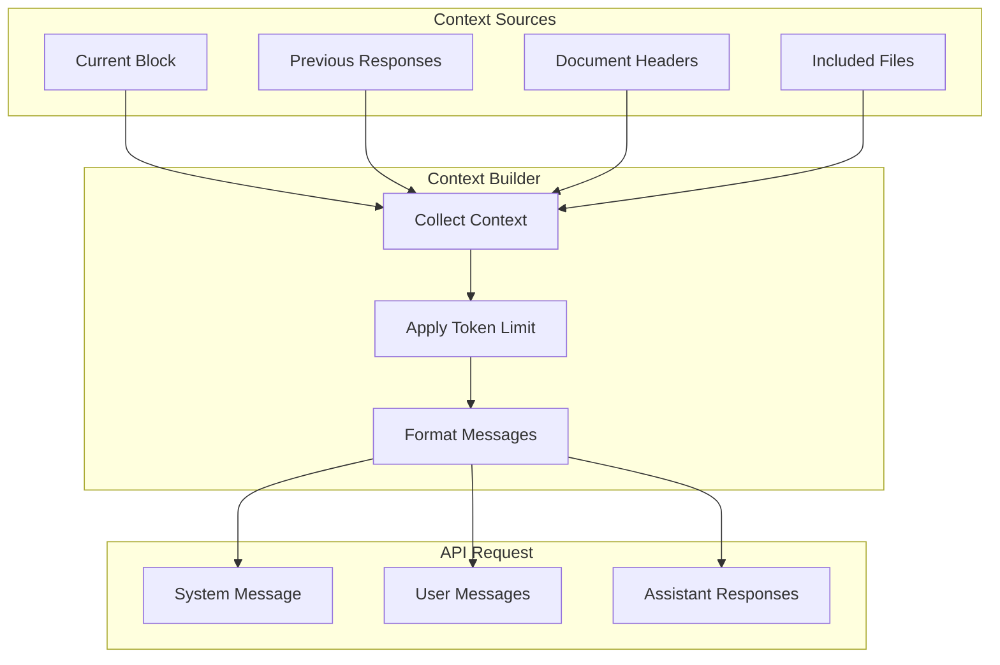

### Speech Integration

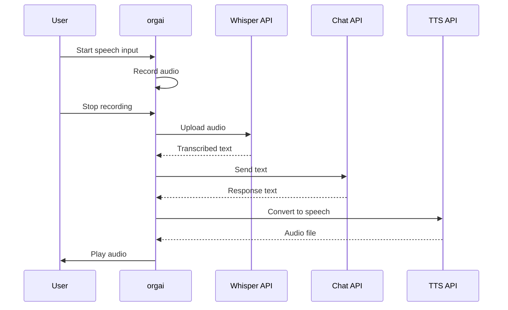

## Limitations

- **OpenAI Only**: Currently only supports OpenAI APIs
- **API Key Required**: Requires valid OpenAI API key
- **Network Dependent**: No offline mode
- **Rate Limits**: Subject to OpenAI rate limiting
- **Cost**: API usage incurs costs

## Resources

### Documentation

- [org-ai GitHub Repository](https://github.com/rksm/org-ai)
- [org-ai Documentation](https://github.com/rksm/org-ai#usage)
- [Demo Project](../../tree/master/demo-org-ai)

### Related Documentation

- [Org-mode Manual](https://orgmode.org/manual/)
- [OpenAI API Documentation](https://platform.openai.com/docs)
- [Elisp Development Guide](../../blob/master/docs/elisp-development.md)

### Examples

See the [demo-org-ai](../../tree/master/demo-org-ai) directory for example configurations and workflows.

---

**Navigation**: [Home](Home) | [Architecture](Architecture) | [gptel](Gptel) | [Ellama](Ellama)
